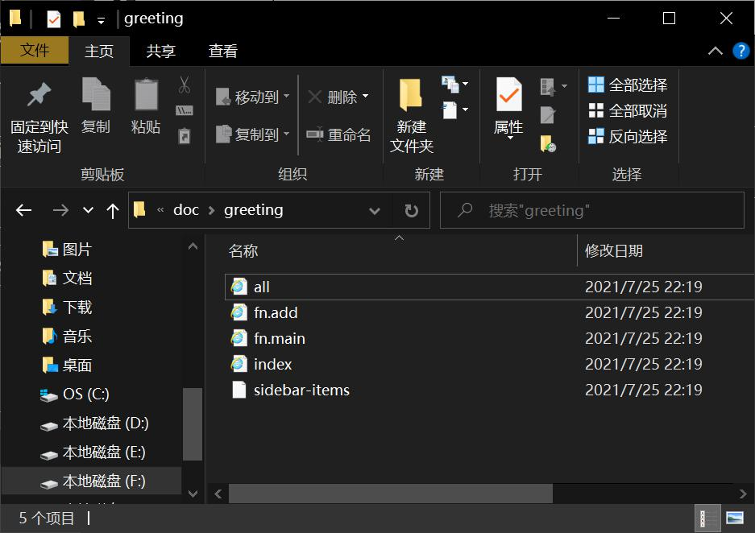
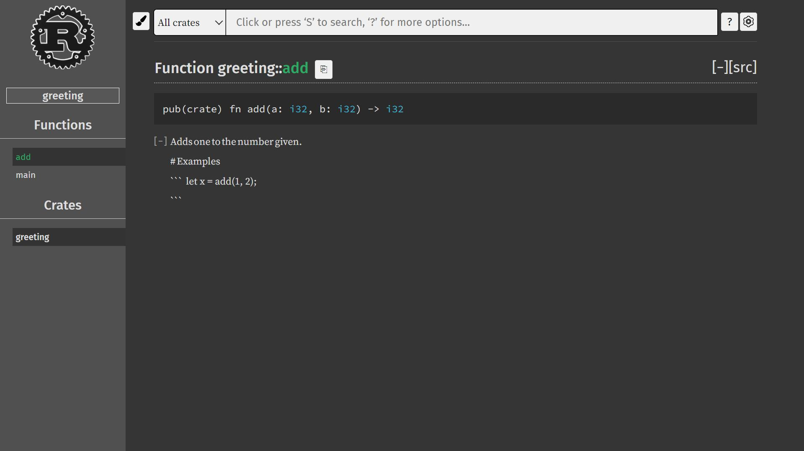
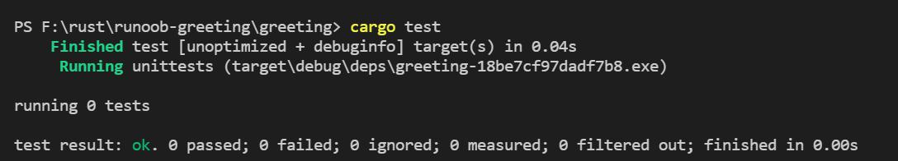

# Rust学习之路

## Rust输出到命令行

* Rust输出到文字的方式主要有两种: `pirntln!()` 和 `print!()`

    这两个“函数”都是命令行输出字符串的方法，区别仅在于前者会在输出最后附加一个换行符。当用这两个“函数”输出信息时，第一个参数时格式字符串，后面是一串可变参数，对应着格式字符串重的“占位符”，这一点与C语言中的printf函数很相似。但是，Rust中格式字符串中的占位符不是“%+字母”的形式，而是一对{}

> 举例

```rust
fn mian(){
    let a = 12;
    println!("a si {}", a);
}
```

以上程序的输出结果是：
> a is 12

如果我想把a输出两遍，不要写成：

```rust
println!("a is {},a again is {}", a, a);
```

更高的写法是：

```rust
println!("a is {0},a again is {0}", a, a);
```

在 `{}` 之间可以放一个数字，它将把之后的可变参数当作一个数组来访问，下标从0开始。
如果要输出 `{` 或 `}` 怎么办呢？格式字符串中通过 `{{` 和 `}}` 分别转义代表 `{` 和 `}` 。但是其他转义字符与C语言里的转义字符一样，都是反斜杆\开头的形式。

```rust
fn main(){
    println!("{{}}");
}
```

以上程序的输出结果是：
>{}

## Rust基础语法

### 变量

首先必须说明，Rust是强类型语言，但具有自动判断变量类型的能力。  
如果要声明变量，需要使用 `let` 关键字。例如：

```rust
let a = 123;
```

在这句声明语句之后，以下三行代码都是被禁止的：

```rust
a = "abc";
a = 4.56;
a = 456;
```

第一行的错误在于当声明a是123以后，a就被确定为整型数字，不能把字符串类型的值赋给它。  
第二行的错误在于自动转换数字精度有损失，Rust语言不允许精度有损失的自动数据类型转换。  
第三行的错误在于a不是个可变变量。

> 第三行代码解释  
Rust语言为了高并发安全而做的设计：在语言层面尽量少的让变量的值可以改变。所以a的值不可变。官方文档称a这种变量为“不可变变量”。

如果我们编写的程序的一部分在假设值永远不会改变的情况下运行，而我们代码的另一个部分在改变该值，那么代码不改变值的那一部分可能就不会按照设计的意图去运转。由于这种原因造成的错误很难在事后找到。这是Rust语言设计这种机制的原因。  
使变量变得“可变”（mutable）只需要一个mut关键字。

```rust
let mut a = 123;
a = 456;
```

这个程序是正确的。

### 常量与不可变变量的区别

在Rust中，以下程序是合法的：

```rust
let a = 123;
let b = 456;
```

但是如果a是常量就不合法;

```rust
const a: i32 = 123;
let  a = 456;
```

变量的值可以重影，但在重影以前不能私自被改变，这样可以确保在每一次重影之后的区域编译器可以充分的推理程序逻辑。虽然Rust有自动判断类型的功能，但有些情况下声明类型更加方便：

```rust
let a: u64 = 123;
```

这里声明了a为无符号64位整型变量，如果没有声明类型，a将自动被判断位有符号32位整型变量，这对于a的取值范围有很大的影响。

### 重影

重影的概念与其他面向对象语言里的“重写”（Override）或“重载”（Overload）是不一样的。  
重影就是指变量的名称可以被重新使用的机制：

```rust
fn main(){
    let x = 5;
    let x = x + 1;
    let x = x * 2;
    println!("The value of x is: {}", x);
}
```

这段程序的运行结果：

> The value of x is: 12

重影与可变变量的赋值不是一个概念，重影是指用同一个名字重新代表另一个变量实体，其类型、可变属性和值都可以变化。但可变变量赋值仅能发生值的变化。

```rust
let mut s = "123";
s = s.len();
```

这段程序会出错：不能给字符串变量赋整型变量。

## Rust数据类型

### 整数型（Integer）

整数型简称整型，按照比特位长度和有无符号分为以下种类：

|位长度|有符号|无符号|
|--|--|--|
|8-bit|i8|u8|
|16-bit|i16|u16|
|32-bit|i32|u32|
|64-bit|i64|u64|
|128-bit|i128|u128|
|arch|isize|usize|

**isize** 和 **usize** 两种整数类型是用来衡量数据大小的，它们的位长度取决于所运行的目标平台，如果是32位架构的处理器将使用32位位长度整型。

整数的表述方法有以下几种：

|进制|例子|
|--|--|
|十进制|98_222|
|十六进制|0xff|
|八进制|0o77|
|二进制|0b1111_0000|
|字节（只能表示u8型）|b'A'|

有的整数中间存在一个下划线，这种设计可以让人们在输入一个很大的数字时更容易判断数字的值大概是多少。

### 浮点数型（Floating-Point）

Rust与其它语言一样支持32位浮点数（f32）和64位浮点数（f64）。默认情况下，64.0将表示64位浮点数，因为现代计算机处理器对于两种浮点数计算的速度几乎相同，但64位浮点数精度更高。

```rust
fn main(){
    let x = 2.0; //f64
    let y: f32 = 3.0; //f32
}
```

### 数学运算

用一段程序反应数学计算：

```rust
fn main(){
    let sum = 5 + 10; //加
    let difference = 95.5 - 4.3; //减
    let product = 4 * 30; //乘
    let quotient = 56.7 / 32.2 //除
    let remainder = 43 % 5; //求余
}
```

许多运算符号之后加上=号是自运算的意思，例如：  
`sum += 1`等同于`sum = sum + 1`  
**注意：** Rust不支持++和--，因为这两个运算符出现在变量的前后会影响代码可读性，减弱了开发者对变量改变的意识能力。

### 布尔型

布尔型用bool表示，值只能为true或false

### 字符型

字符型用char表示。  
Rust的char类型大小为4字节，代表Unicode标量值。中文，日文和韩文字等非英文字符甚至表情符号和零宽度空格在Rust中都是有效的char值。  
Unicode值的范围从U+0000到U+D7FF和U+E000到U+10FFFF（包括两端），但是，“字符”这个概念并不存在于Unicode中，因此对“字符”是什么的直觉可能与Rust中的字符概念不匹配。所以一般推荐使用字符串储存UTF-8文字（非英文字符尽可能地出现在字符串中）。  
**注意：** 由于中文文字编码有两种（GBK和UTF-8），所以编程中使用中文字符串可能导致乱码的出现，这是因为源程序与命名行的文字编码不一致，所以在Rust中字符串和字符都必须使用UTF-8编码，否则编译器会报错。

### 复合类型

元组用一对`()`包括的一组数据，可以包含不同种类的数据：

```rust
let tup: (i32, f64, u8) = (500, 6.4, 1);
/*  tup.0 等于 500
    tup.1 等于 6.4
    tup.2 等于 1
 */
let (x, y, z) = tup;
// y 等于 6.4
```

数组用一对`[]`包括的同类型数据。

```rust
let a = [1, 2, 3, 4, 5];
// a是一个长度为5的整型数组

let b = ["January", "February", "March"];
// b是一个长度为3的字符串数组

let c: [i32; 5] = [1, 2, 3, 4, 5];
// c是一个长度为5的i32数组

let d = [3; 5];
// 等同于let d = [3, 3, 3, 3, 3];

let first = a[0];
let second = a[1];
// 数组访问

a[0] = 123; // 错误：数组a不可变
let mut a = [1, 2, 3];
a[0] = 4; // 正确
```

## Rust注释

Rust中的注释方式与其它语言（C、Java）一样，支持两种注释方式：

```rust
// 这是第一种注释方式

/* 这是第二种注释方式 */

/*
 * 多行注释
 * 多行注释
 * 多行注释
 */
```

## 用于说明文档的注释

在Rust中使用`//`可以使其之后到第一个换行符的内容变成注释。  
在这种规则下，三个反斜杠`///`依然是合法的注释开始。所以Rust可以用`///`作为说明文档注释的开头：

```rust
/// Adds one to the number given.
/// 
/// # Examples
/// 
/// ```
/// let x = add(1, 2);
/// 
/// ```

fn add(a: i32,b: i32) -> i32 {
    return a + b;
}

fn main(){
    println！("{}",add(2,3));
}
```

运行`cargo doc`会生成这个文档注释的HTML文档。  



运行`cargo doc --open`会构建当前crate文档的HTML并在浏览器中打开。



运行`cargo test`将会对注释文档中的示例代码进行测试



## Rust函数

函数在Rust语言中是普遍存在的。

> `fn <函数名>(<参数>){<函数体>}`

其中Rust函数名称的命名风格是小写字母以下划线分割：

```rust
fn main(){
    println!("Hello, world!");
    another_function();
}

fn another_function(){
    println!("Hello, runoob!");
}
```

运行结果：
> Hello,world!  
Hello,runoob!

**注意：** 在源代码中的main函数之后定义了another_function。Rust不在乎在何处定义函数，只需在某个地方定义他们即可。

### 函数参数

Rust中定义函数如果需要具备参数必须声明参数名称和类型：

```rust
fn main(){
    anther_function(5, 6);
}

fn anther_function(x: i32, y: i32){
    println!("x的值为：{}", x);
    println!("y的值为：{}", y);
}
```

### 函数体的语句和表达式

Rust函数体由一系列可以以表达式（Expression）结尾的语句（Statement）组成。到目前为止，我们仅见到了没有以表达式结尾的函数，但已经将表达式用作语句的一部分。  
语句是执行某些操作且没有返回值的步骤。例如：  

```rust
let a = 6
```

这个步骤没有返回值，所以以下语句不正确：

```rust
let a = (let b = 2);
```

表达式有计算步骤且有返回值。以下是表达式（假设出现的标识符已经被定义）：

```rust
a = 7
b + 2
c * (a + b)
```

Rust中可以在一个用`{}`包括的块里面编写一个较为复杂的表达式：

```rust
fn main(){
    let x = 5;

    let y = {
        let x = 3;
        x + 1
    };

    println!("x的值为：{}", x);
    println!("y的值为：{}", y);
}
```

运行结果：
> x的值为：5  
y的值为：4

这段程序中包含了一个表达式块：

```rust
{
    let x = 3;
    x + 1
};
```

而且在块中可以使用函数语句，最后一个步骤是表达式，此表达式的结果值是整个表达式块所代表的值。这种表达式块叫做函数体表达式。  
**注意：** `x + 1`之后没有分号，否则它将变成一条语句！  
这种表达式块是一个合法的函数体。而且在Rust中，函数定义可以嵌套：

```rust
fn main(){
    fn five() -> i32{
        5
    }
    println!("five()的值为：{}",five());
}
```

### 函数返回值

在上一个嵌套的例子中已经显示了Rust函数声明返回值类型的方式：在参数声明之后用`->`来声明函数返回值的类型（不是`:`）。  
在函数体中，随时都可以以return关键字结束函数运行并返回一个类型合适的值。这也是最接近大多数开发者经验的做法：

```rust
fn add(a: i32, b: i32) -> i32 {
    return a + b;
}
```

但是Rust不支持自动返回值类型判断！如果没有明确声明函数返回值的类型，函数将被认为是“纯过程”，不允许产生返回值，`return`后面不能有返回值表达式。这样做的目的是为了让公开的函数能够形成可见的公报。  
**注意：** 函数表达式并不能等同于函数体，它不能使用 **return关键字**。

## Rust条件语句

在Rust语言中的条件语句是这种格式的：

```rust
fn main(){
    let number = 3;
    if number < 5 {
        println!("条件为true");
    } else {
        println!("条件为false");
    }
}
```

在上述程序中有条件`if`语句，这个语法在很多其它语言中很常见，但也有一些区别：首先，条件表达式`number < 5`不需要用小括号包括（**注意：**不需要不是不允许）。但是Rust中的if不存在单语句不用加`{}`的规则，不允许使用一个语句代替一个块。尽管如此，Rust还是支传统else-if语法的：

```rust
fn main(){
    let a = 12;
    let b;
    if a > 0 {
        b = 1;
    }
    else if a < 0 {
        b = -1;
    }
    else {
        b = 0;
    }
    println!("b is {}", b);
}
```

运行结果：
> b is 1

Rust中的条件表达式必须是bool类型，例如下面的程序就是错误的：

```rust
fn main(){
    let number = 3;
    if number{  // 报错，expected `bool`, found intergerrustc(E0308)
        println!("Yes");
    }
}
```

虽然C/C++语言中的条件表达式用整数表示，非0即真，但这个规则在很多注重代码安全性的语言中是被禁止的。
结合之前章学习的函数体表达式，我们加以联想：

```rust
if <condition> {block 1} else {block 2}
```

这种语法中的`{block 1}`和`{block 2}`可不可以是函数体表达式呢？  
答案是肯定的！在Rust中我们可以使用`if-else`结构实现类似于三元条件运算表达式`(A?B:C)`的效果：

```rust
fn main(){
    let a =3;
    let number = if a > 0 { 1 } else { 0 };
    println!("number 为 {}", number);
}
```

运行结果：
> number 为 1

**注意：**两个函数体表达式的类型必须一样！且必须有一个else及其后面的表达式块。

## Rust循环

### while循环

while循环是最典型的条件语句循环：

```rust
fn main(){
    let mut number = 1;
    while number != 4 {
        println!("{}", number);
        number += 1;
    }
    println!("EXIT");
}
```

运行结果：
> 1  
2  
3  
EXIT

Rust语言到今日还没有do-while的用法，但是do被规定为保留字，也许以后的版本中会用到。  
在C语言中for循环使用三元语句控制循环，但是Rust中没有这种用法，需要用while循环来替代：

> c语言

```c
int i;
for (i = 0; i < 10; i++){
    // 循环体
}
```

> Rust

```rust
let mut i = 0;
while i < 10 {
    // 循环体
    i += 1;
}
```

### for循环

for循环是最常用的循环结构，常用来遍历一个线性数据结构（比如数组）。for循环遍历数组：

```rust
fn main(){
    let a = [10, 20, 30, 40, 50];
    for i in a.iter(){
        println!("值为：{}", i);
    }
}
```

运行结果：

> 值为：10  
值为：20  
值为：30  
值为：40  
值为：50

这个程序中的`for`循环完成了对数组a的遍历。`a.iter()`代表`a`的迭代器（iterator）  
for循环其实是可以通过下标来访问数组的：

```rust
fn main(){
    let a = [10, 20, 30, 40, 50];
    for i in 0..5 {
        println!("a[{0}] = {1}", i, a[i]);
    }
}
```

运行结果：
> a[0] = 10  
a[1] = 20  
a[2] = 30  
a[3] = 40  
a[4] = 50

### loop循环

经常碰到这样的情况：某个循环无法在开头和结尾判断是否继续进行循环，必须在循环体中间某处控制循环的进行。如果遇到这种情况，一般在一个`while(true)`循环体里实现中途退出循环的操作。  
Rust语言有原生的无限循环结构——loop：

```rust
fn main(){
    let s = ['R', 'U', 'N', 'O', 'O', 'B'];
    let mut i = 0;
    loop{
        let ch = s[i];
        if ch == 'O' {
            break;
        }
        println!("\'{}\'", ch);
        i += 1;
    }    
}
```

运行结果：
> 'R'  
'U'  
'N'

loop循环可以通过break关键字类似于return一样使整个循环退出并给予外部一个返回值。这是一个十分巧妙的设计，因为loop这样的循环常被用来当做查找工具使用，如果找了某个东西当然要将这个结果交出去：

```rust
fn main(){
    let s = ['R', 'U', 'N', 'O', 'O', 'B'];
    let mut i = 0;
    let location = loop{
        let ch = s[i];
        if ch == 'O' {
            break i;
        }
        i += 1;
    };
    println!("\'O\' 的索引为 {}", location);
}
```

运行结果：
> 'O' 的索引为 3

