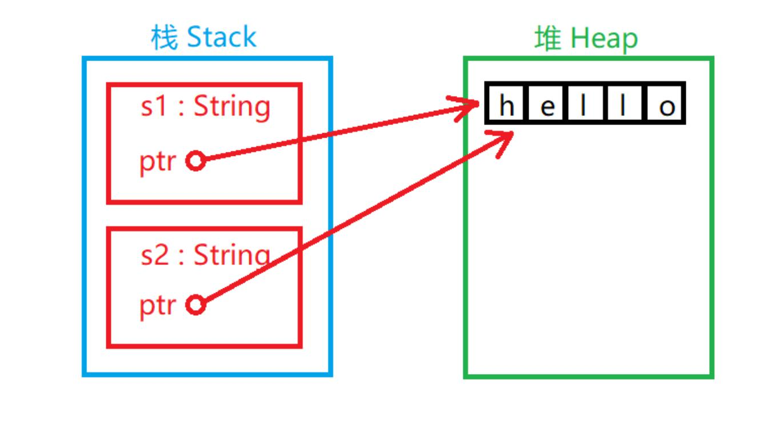
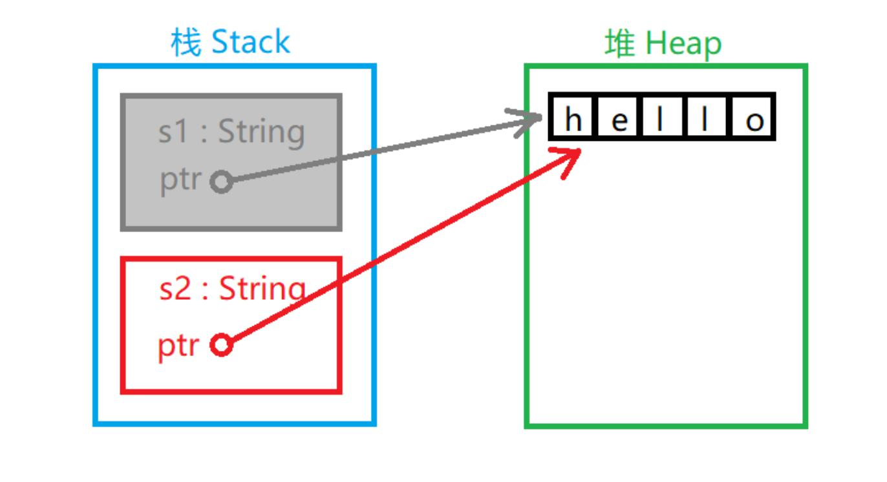
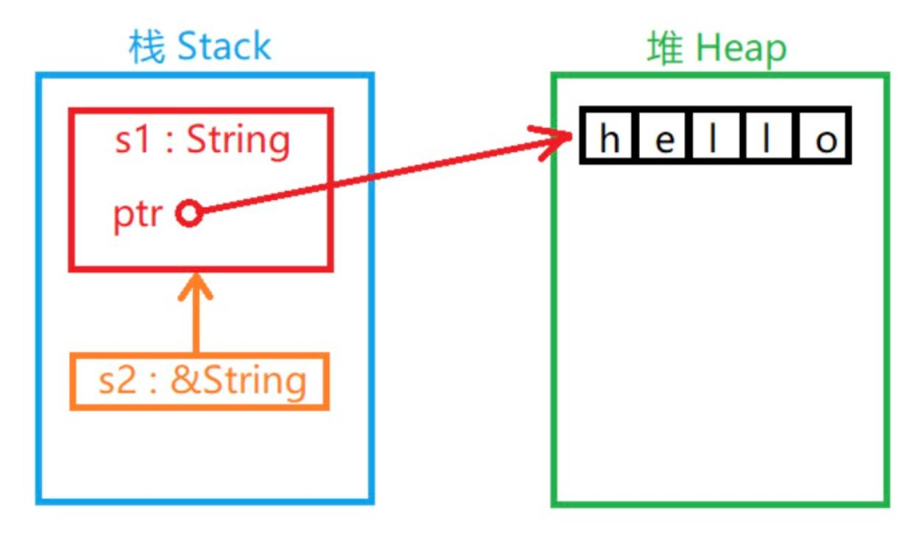
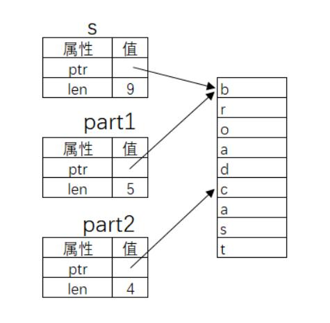
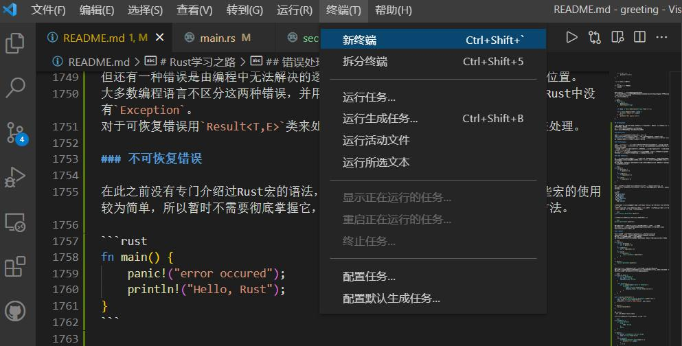
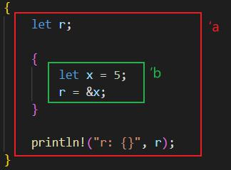

# Rust学习之路

- [Rust学习之路](#rust学习之路)
  - [Rust输出到命令行](#rust输出到命令行)
  - [Rust基础语法](#rust基础语法)
    - [变量](#变量)
    - [常量与不可变变量的区别](#常量与不可变变量的区别)
    - [重影](#重影)
  - [Rust数据类型](#rust数据类型)
    - [整数型（Integer）](#整数型integer)
    - [浮点数型（Floating-Point）](#浮点数型floating-point)
    - [数学运算](#数学运算)
    - [布尔型](#布尔型)
    - [字符型](#字符型)
    - [复合类型](#复合类型)
  - [Rust注释](#rust注释)
  - [用于说明文档的注释](#用于说明文档的注释)
  - [Rust函数](#rust函数)
    - [函数参数](#函数参数)
    - [函数体的语句和表达式](#函数体的语句和表达式)
    - [函数返回值](#函数返回值)
  - [Rust条件语句](#rust条件语句)
  - [Rust循环](#rust循环)
    - [while循环](#while循环)
    - [for循环](#for循环)
    - [loop循环](#loop循环)
  - [Rust所有权](#rust所有权)
    - [所有权规则](#所有权规则)
    - [变量范围](#变量范围)
    - [内存与分配](#内存与分配)
    - [变量与数据交互的方式](#变量与数据交互的方式)
    - [移动](#移动)
    - [克隆](#克隆)
    - [涉及函数传参的所有权机制](#涉及函数传参的所有权机制)
    - [函数返回值的所有权机制](#函数返回值的所有权机制)
    - [引用与租借](#引用与租借)
    - [垂悬引用（Dangling References）](#垂悬引用dangling-references)
  - [Rust Slice（切片）类型](#rust-slice切片类型)
    - [字符串切片](#字符串切片)
    - [非字符串切片](#非字符串切片)
  - [Rust结构体](#rust结构体)
    - [结构体定义](#结构体定义)
    - [结构体实例](#结构体实例)
    - [元组结构体](#元组结构体)
    - [结构体所有权](#结构体所有权)
      - [输出结构体](#输出结构体)
      - [结构体方法](#结构体方法)
    - [结构体关联函数](#结构体关联函数)
      - [单元结构体](#单元结构体)
  - [Ruct枚举类](#ruct枚举类)
    - [match语法](#match语法)
    - [Option枚举类](#option枚举类)
    - [if let 语法](#if-let-语法)
  - [Rust组织管理](#rust组织管理)
    - [箱（Crate）](#箱crate)
    - [包（Package）](#包package)
    - [模块 （Moudle）](#模块-moudle)
    - [访问权限](#访问权限)
    - [难以发现的模块](#难以发现的模块)
    - [use关键字](#use关键字)
    - [引用标准库](#引用标准库)
  - [错误处理](#错误处理)
    - [不可恢复错误](#不可恢复错误)
    - [可恢复的错误](#可恢复的错误)
    - [可恢复的错误的传递](#可恢复的错误的传递)
    - [kind方法](#kind方法)
  - [Rust泛型与特性](#rust泛型与特性)
    - [在函数中定义泛型](#在函数中定义泛型)
    - [结构体和枚举类中的泛型](#结构体和枚举类中的泛型)
    - [特性](#特性)
    - [默认特性](#默认特性)
    - [特性做参数](#特性做参数)
    - [特性做返回值](#特性做返回值)
    - [有条件实现方法](#有条件实现方法)
  - [Rust生命周期](#rust生命周期)
    - [生命周期注释](#生命周期注释)
    - [结构体中使用字符串切片引用](#结构体中使用字符串切片引用)
    - [静态生命周期](#静态生命周期)
    - [泛型、特性与生命周期协同作战](#泛型特性与生命周期协同作战)
  - [Rust文件与IO](#rust文件与io)
    - [接收命令行参数](#接收命令行参数)
    - [命令行输入](#命令行输入)
    - [文件读取](#文件读取)
    - [文件写入](#文件写入)
  - [Rust集合与字符串](#rust集合与字符串)
    - [向量](#向量)
    - [字符串](#字符串)

## Rust输出到命令行

* Rust输出到文字的方式主要有两种: `pirntln!()` 和 `print!()`

    这两个“函数”都是命令行输出字符串的方法，区别仅在于前者会在输出最后附加一个换行符。当用这两个“函数”输出信息时，第一个参数时格式字符串，后面是一串可变参数，对应着格式字符串重的“占位符”，这一点与C语言中的printf函数很相似。但是，Rust中格式字符串中的占位符不是“%+字母”的形式，而是一对{}

> 举例

```rust
fn mian(){
    let a = 12;
    println!("a si {}", a);
}
```

以上程序的输出结果是：
> a is 12

如果我想把a输出两遍，不要写成：

```rust
println!("a is {},a again is {}", a, a);
```

更高的写法是：

```rust
println!("a is {0},a again is {0}", a, a);
```

在 `{}` 之间可以放一个数字，它将把之后的可变参数当作一个数组来访问，下标从0开始。
如果要输出 `{` 或 `}` 怎么办呢？格式字符串中通过 `{{` 和 `}}` 分别转义代表 `{` 和 `}` 。但是其他转义字符与C语言里的转义字符一样，都是反斜杆\开头的形式。

```rust
fn main(){
    println!("{{}}");
}
```

以上程序的输出结果是：
>{}

## Rust基础语法

### 变量

首先必须说明，Rust是强类型语言，但具有自动判断变量类型的能力。  
如果要声明变量，需要使用 `let` 关键字。例如：

```rust
let a = 123;
```

在这句声明语句之后，以下三行代码都是被禁止的：

```rust
a = "abc";
a = 4.56;
a = 456;
```

第一行的错误在于当声明a是123以后，a就被确定为整型数字，不能把字符串类型的值赋给它。  
第二行的错误在于自动转换数字精度有损失，Rust语言不允许精度有损失的自动数据类型转换。  
第三行的错误在于a不是个可变变量。

> 第三行代码解释  
Rust语言为了高并发安全而做的设计：在语言层面尽量少的让变量的值可以改变。所以a的值不可变。官方文档称a这种变量为“不可变变量”。

如果我们编写的程序的一部分在假设值永远不会改变的情况下运行，而我们代码的另一个部分在改变该值，那么代码不改变值的那一部分可能就不会按照设计的意图去运转。由于这种原因造成的错误很难在事后找到。这是Rust语言设计这种机制的原因。  
使变量变得“可变”（mutable）只需要一个mut关键字。

```rust
let mut a = 123;
a = 456;
```

这个程序是正确的。

### 常量与不可变变量的区别

在Rust中，以下程序是合法的：

```rust
let a = 123;
let b = 456;
```

但是如果a是常量就不合法;

```rust
const a: i32 = 123;
let  a = 456;
```

变量的值可以重影，但在重影以前不能私自被改变，这样可以确保在每一次重影之后的区域编译器可以充分的推理程序逻辑。虽然Rust有自动判断类型的功能，但有些情况下声明类型更加方便：

```rust
let a: u64 = 123;
```

这里声明了a为无符号64位整型变量，如果没有声明类型，a将自动被判断位有符号32位整型变量，这对于a的取值范围有很大的影响。

### 重影

重影的概念与其他面向对象语言里的“重写”（Override）或“重载”（Overload）是不一样的。  
重影就是指变量的名称可以被重新使用的机制：

```rust
fn main(){
    let x = 5;
    let x = x + 1;
    let x = x * 2;
    println!("The value of x is: {}", x);
}
```

这段程序的运行结果：

> The value of x is: 12

重影与可变变量的赋值不是一个概念，重影是指用同一个名字重新代表另一个变量实体，其类型、可变属性和值都可以变化。但可变变量赋值仅能发生值的变化。

```rust
let mut s = "123";
s = s.len();
```

这段程序会出错：不能给字符串变量赋整型变量。

## Rust数据类型

### 整数型（Integer）

整数型简称整型，按照比特位长度和有无符号分为以下种类：

|位长度|有符号|无符号|
|--|--|--|
|8-bit|i8|u8|
|16-bit|i16|u16|
|32-bit|i32|u32|
|64-bit|i64|u64|
|128-bit|i128|u128|
|arch|isize|usize|

**isize** 和 **usize** 两种整数类型是用来衡量数据大小的，它们的位长度取决于所运行的目标平台，如果是32位架构的处理器将使用32位位长度整型。

整数的表述方法有以下几种：

|进制|例子|
|--|--|
|十进制|98_222|
|十六进制|0xff|
|八进制|0o77|
|二进制|0b1111_0000|
|字节（只能表示u8型）|b'A'|

有的整数中间存在一个下划线，这种设计可以让人们在输入一个很大的数字时更容易判断数字的值大概是多少。

### 浮点数型（Floating-Point）

Rust与其它语言一样支持32位浮点数（f32）和64位浮点数（f64）。默认情况下，64.0将表示64位浮点数，因为现代计算机处理器对于两种浮点数计算的速度几乎相同，但64位浮点数精度更高。

```rust
fn main(){
    let x = 2.0; //f64
    let y: f32 = 3.0; //f32
}
```

### 数学运算

用一段程序反应数学计算：

```rust
fn main(){
    let sum = 5 + 10; //加
    let difference = 95.5 - 4.3; //减
    let product = 4 * 30; //乘
    let quotient = 56.7 / 32.2 //除
    let remainder = 43 % 5; //求余
}
```

许多运算符号之后加上=号是自运算的意思，例如：  
`sum += 1`等同于`sum = sum + 1`  
**注意：** Rust不支持++和--，因为这两个运算符出现在变量的前后会影响代码可读性，减弱了开发者对变量改变的意识能力。

### 布尔型

布尔型用bool表示，值只能为true或false

### 字符型

字符型用char表示。  
Rust的char类型大小为4字节，代表Unicode标量值。中文，日文和韩文字等非英文字符甚至表情符号和零宽度空格在Rust中都是有效的char值。  
Unicode值的范围从U+0000到U+D7FF和U+E000到U+10FFFF（包括两端），但是，“字符”这个概念并不存在于Unicode中，因此对“字符”是什么的直觉可能与Rust中的字符概念不匹配。所以一般推荐使用字符串储存UTF-8文字（非英文字符尽可能地出现在字符串中）。  
**注意：** 由于中文文字编码有两种（GBK和UTF-8），所以编程中使用中文字符串可能导致乱码的出现，这是因为源程序与命名行的文字编码不一致，所以在Rust中字符串和字符都必须使用UTF-8编码，否则编译器会报错。

### 复合类型

元组用一对`()`包括的一组数据，可以包含不同种类的数据：

```rust
let tup: (i32, f64, u8) = (500, 6.4, 1);
/*  tup.0 等于 500
    tup.1 等于 6.4
    tup.2 等于 1
 */
let (x, y, z) = tup;
// y 等于 6.4
```

数组用一对`[]`包括的同类型数据。

```rust
let a = [1, 2, 3, 4, 5];
// a是一个长度为5的整型数组

let b = ["January", "February", "March"];
// b是一个长度为3的字符串数组

let c: [i32; 5] = [1, 2, 3, 4, 5];
// c是一个长度为5的i32数组

let d = [3; 5];
// 等同于let d = [3, 3, 3, 3, 3];

let first = a[0];
let second = a[1];
// 数组访问

a[0] = 123; // 错误：数组a不可变
let mut a = [1, 2, 3];
a[0] = 4; // 正确
```

## Rust注释

Rust中的注释方式与其它语言（C、Java）一样，支持两种注释方式：

```rust
// 这是第一种注释方式

/* 这是第二种注释方式 */

/*
 * 多行注释
 * 多行注释
 * 多行注释
 */
```

## 用于说明文档的注释

在Rust中使用`//`可以使其之后到第一个换行符的内容变成注释。  
在这种规则下，三个反斜杠`///`依然是合法的注释开始。所以Rust可以用`///`作为说明文档注释的开头：

```rust
/// Adds one to the number given.
/// 
/// # Examples
/// 
/// ```
/// let x = add(1, 2);
/// 
/// ```

fn add(a: i32,b: i32) -> i32 {
    return a + b;
}

fn main(){
    println！("{}",add(2,3));
}
```

运行`cargo doc`会生成这个文档注释的HTML文档。  


运行`cargo doc --open`会构建当前crate文档的HTML并在浏览器中打开。


运行`cargo test`将会对注释文档中的示例代码进行测试


## Rust函数

函数在Rust语言中是普遍存在的。

> `fn <函数名>(<参数>){<函数体>}`

其中Rust函数名称的命名风格是小写字母以下划线分割：

```rust
fn main(){
    println!("Hello, world!");
    another_function();
}

fn another_function(){
    println!("Hello, runzm!");
}
```

运行结果：
> Hello,world!  
Hello,runzm!

**注意：** 在源代码中的main函数之后定义了another_function。Rust不在乎在何处定义函数，只需在某个地方定义他们即可。

### 函数参数

Rust中定义函数如果需要具备参数必须声明参数名称和类型：

```rust
fn main(){
    anther_function(5, 6);
}

fn anther_function(x: i32, y: i32){
    println!("x的值为：{}", x);
    println!("y的值为：{}", y);
}
```

### 函数体的语句和表达式

Rust函数体由一系列可以以表达式（Expression）结尾的语句（Statement）组成。到目前为止，我们仅见到了没有以表达式结尾的函数，但已经将表达式用作语句的一部分。  
语句是执行某些操作且没有返回值的步骤。例如：  

```rust
let a = 6
```

这个步骤没有返回值，所以以下语句不正确：

```rust
let a = (let b = 2);
```

表达式有计算步骤且有返回值。以下是表达式（假设出现的标识符已经被定义）：

```rust
a = 7
b + 2
c * (a + b)
```

Rust中可以在一个用`{}`包括的块里面编写一个较为复杂的表达式：

```rust
fn main(){
    let x = 5;

    let y = {
        let x = 3;
        x + 1
    };

    println!("x的值为：{}", x);
    println!("y的值为：{}", y);
}
```

运行结果：
> x的值为：5  
y的值为：4

这段程序中包含了一个表达式块：

```rust
{
    let x = 3;
    x + 1
};
```

而且在块中可以使用函数语句，最后一个步骤是表达式，此表达式的结果值是整个表达式块所代表的值。这种表达式块叫做函数体表达式。  
**注意：** `x + 1`之后没有分号，否则它将变成一条语句！  
这种表达式块是一个合法的函数体。而且在Rust中，函数定义可以嵌套：

```rust
fn main(){
    fn five() -> i32{
        5
    }
    println!("five()的值为：{}",five());
}
```

### 函数返回值

在上一个嵌套的例子中已经显示了Rust函数声明返回值类型的方式：在参数声明之后用`->`来声明函数返回值的类型（不是`:`）。  
在函数体中，随时都可以以return关键字结束函数运行并返回一个类型合适的值。这也是最接近大多数开发者经验的做法：

```rust
fn add(a: i32, b: i32) -> i32 {
    return a + b;
}
```

但是Rust不支持自动返回值类型判断！如果没有明确声明函数返回值的类型，函数将被认为是“纯过程”，不允许产生返回值，`return`后面不能有返回值表达式。这样做的目的是为了让公开的函数能够形成可见的公报。  
**注意：** 函数表达式并不能等同于函数体，它不能使用 **return关键字**。

## Rust条件语句

在Rust语言中的条件语句是这种格式的：

```rust
fn main(){
    let number = 3;
    if number < 5 {
        println!("条件为true");
    } else {
        println!("条件为false");
    }
}
```

在上述程序中有条件`if`语句，这个语法在很多其它语言中很常见，但也有一些区别：首先，条件表达式`number < 5`不需要用小括号包括（**注意：**不需要不是不允许）。但是Rust中的if不存在单语句不用加`{}`的规则，不允许使用一个语句代替一个块。尽管如此，Rust还是支传统else-if语法的：

```rust
fn main(){
    let a = 12;
    let b;
    if a > 0 {
        b = 1;
    }
    else if a < 0 {
        b = -1;
    }
    else {
        b = 0;
    }
    println!("b is {}", b);
}
```

运行结果：
> b is 1

Rust中的条件表达式必须是bool类型，例如下面的程序就是错误的：

```rust
fn main(){
    let number = 3;
    if number{  // 报错，expected `bool`, found intergerrustc(E0308)
        println!("Yes");
    }
}
```

虽然C/C++语言中的条件表达式用整数表示，非0即真，但这个规则在很多注重代码安全性的语言中是被禁止的。
结合之前章学习的函数体表达式，我们加以联想：

```rust
if <condition> {block 1} else {block 2}
```

这种语法中的`{block 1}`和`{block 2}`可不可以是函数体表达式呢？  
答案是肯定的！在Rust中我们可以使用`if-else`结构实现类似于三元条件运算表达式`(A?B:C)`的效果：

```rust
fn main(){
    let a =3;
    let number = if a > 0 { 1 } else { 0 };
    println!("number 为 {}", number);
}
```

运行结果：
> number 为 1

**注意：**两个函数体表达式的类型必须一样！且必须有一个else及其后面的表达式块。

## Rust循环

### while循环

while循环是最典型的条件语句循环：

```rust
fn main(){
    let mut number = 1;
    while number != 4 {
        println!("{}", number);
        number += 1;
    }
    println!("EXIT");
}
```

运行结果：
> 1  
2  
3  
EXIT

Rust语言到今日还没有do-while的用法，但是do被规定为保留字，也许以后的版本中会用到。  
在C语言中for循环使用三元语句控制循环，但是Rust中没有这种用法，需要用while循环来替代：

> c语言

```c
int i;
for (i = 0; i < 10; i++){
    // 循环体
}
```

> Rust

```rust
let mut i = 0;
while i < 10 {
    // 循环体
    i += 1;
}
```

### for循环

for循环是最常用的循环结构，常用来遍历一个线性数据结构（比如数组）。for循环遍历数组：

```rust
fn main(){
    let a = [10, 20, 30, 40, 50];
    for i in a.iter(){
        println!("值为：{}", i);
    }
}
```

运行结果：

> 值为：10  
值为：20  
值为：30  
值为：40  
值为：50

这个程序中的`for`循环完成了对数组a的遍历。`a.iter()`代表`a`的迭代器（iterator）  
for循环其实是可以通过下标来访问数组的：

```rust
fn main(){
    let a = [10, 20, 30, 40, 50];
    for i in 0..5 {
        println!("a[{0}] = {1}", i, a[i]);
    }
}
```

运行结果：
> a[0] = 10  
a[1] = 20  
a[2] = 30  
a[3] = 40  
a[4] = 50

### loop循环

经常碰到这样的情况：某个循环无法在开头和结尾判断是否继续进行循环，必须在循环体中间某处控制循环的进行。如果遇到这种情况，一般在一个`while(true)`循环体里实现中途退出循环的操作。  
Rust语言有原生的无限循环结构——loop：

```rust
fn main(){
    let s = ['R', 'U', 'N', 'Z', 'M'];
    let mut i = 0;
    loop{
        let ch = s[i];
        if ch == 'Z' {
            break;
        }
        println!("\'{}\'", ch);
        i += 1;
    }    
}
```

运行结果：
> 'R'  
'U'  
'N'

loop循环可以通过break关键字类似于return一样使整个循环退出并给予外部一个返回值。这是一个十分巧妙的设计，因为loop这样的循环常被用来当做查找工具使用，如果找了某个东西当然要将这个结果交出去：

```rust
fn main(){
    let s = ['R', 'U', 'N', 'Z', 'M'];
    let mut i = 0;
    let location = loop{
        let ch = s[i];
        if ch == 'Z' {
            break i;
        }
        i += 1;
    };
    println!("\'Z\' 的索引为 {}", location);
}
```

运行结果：
> 'Z' 的索引为 3

## Rust所有权

计算机程序必须在运行时管理它们所使用的内存资源。  
大多数的编程语言都有管理内存的功能：  
C/C++这样的语言主要通过手动方式管理内存，开发者需要手动的申请和释放内存资源。但为了提高开发效率，只要不影响程序功能的实现，许多开发者没有及时释放内存的习惯。所以手动管理内存的方式通常造成资源浪费。  
Java语言编写的程序在虚拟机（JVM）中运行，JVM具备自动回收内存资源的功能。但这种方式常常会降低运行时效率，所以JVM会尽可能少的回收资源，这样也会使程序占用较大的内存资源。
所有权是一个新颖的概念，它是Rust语言为高效使用内存而设计的语法机制。所有权概念是为了让Rust在编译阶段更有效地分析内存资源的有用性以实现内存管理而诞生的概念。

### 所有权规则

所有权有以下三条规则：

* Rust中的每个值都有一个变量，称为其所有者。

* 一次只能有一个所有者。

* 当所有者不在程序运行范围时，该值将被删除。

这三条规则是所有权概念的基础。  
接下来将介绍与所有权概念有关的概念。

### 变量范围

用下面这段程序描述变量范围的概念：

```rust
{
    // 在声明以前，变量s无效
    let s ="runzm";
    // 这里是变量s的可用范围
}
// 变量范围已经结束，变量s无效
```

变量范围是变量的一个属性，其代表变量的可行域，默认从声明变量开始有效直到变量所在域结束。

### 内存与分配

如果我们定义了一个变量并给它赋予一个值，这个变量的值存在于内存中。这种情况很普遍。但如果我们需要储存的数据长度不确定（比如用户输入的一串字符串），我们就无法在定义时明确数据长度，也就无法在编译阶段令程序分配固定长度的内存空间供数据存储使用。这就需要提供一种在程序运行时程序自己申请使用内存的机制——堆。这里的"内存资源"都指的是堆所占用的内存空间。  
有分配就有释放，程序不能一直占用某个内存资源。因此决定资源是否浪费的关键因素就是资源有没有及时的释放。  
字符串样例程序用C语言等价编写：

```c
{
    char *s = strdup("runzm");
    free(s); // 释放s资源
}
```

显然，Rust中没有调用free函数来释放字符串s的资源（这里在C语言中是不正确的写法，因为“runoob”不在堆中，这里假设它在）。Rust之所以没有明示释放的步骤是因为在变量范围结束的时候，Rust编译器自动添加了调用释放资源函数的步骤。  
这种机制看似很简单了：它不过是帮助程序员在适当的地方添加了一个释放资源的函数调用而已。但这种简单的机制可以有效地解决一个史上最令程序员头疼的编程问题。

### 变量与数据交互的方式

变量与数据交互的方式主要有移动（Move）和克隆（Clone）两种：

### 移动

多个变量可以在Rust中以不同的方式与相同的数据交互：

```rust
let x = 5;
let y = x;
```

这个程序将值5绑定到变量x，然后将x的值复制并赋值给变量y。现在栈中将有两个值5。此情况中的数据是“基本数据”类型的数据，不需要储存到堆中，仅在栈中的数据的“移动”方式是直接复制，这不会花费更长的时间或更多的储存空间。“基本数据”类型有这些：

* 所有整数类型，例如i32、u32、i64等。

* 布尔类型bool，值为true或false。

* 所有浮点类型，f32和f64。

* 字符类型char。

* 仅包含以上类型数据的元组（Tuples）。

但如果发生交互的数据在堆中就是另外一种情况：

```rust
let s1 = String::from("hello");
let s2 = s1;
```

第一步产生一个S听对象，值为“hello”。其中“hello”可以认为是类似于长度不确定的数据，需要在堆中储存。  
第二步的情况略有不同（ **这不是完全真的，仅用来对比参考** ）：



如图所示：两个String对象在栈中，每个String对象都有一个指针指向堆中的“hello”字符串。在给s2赋值时，只有栈中的数据被复制了，堆中的字符串还是原来的字符串。  
当变量超出范围时，Rust自动调用释放资源函数并清理该变量的堆内存。但是s1和s2都被释放的话，堆区中的“hello”将被释放两次，这是不被系统允许的。为了确保安全，在给s2赋值时s1已经无效了。没错，在把s1的值赋给s2以后s1将不可以再被使用。下面这段程序是错的：

```rust
let s1 = String::from("hello");
let s2 = s1;
println!("{}, world!", s1); //错误！s1已经失效
```

所以实际情况是：



s1名存实亡。

### 克隆

Rust会尽可能地降低程序的运行成本，所以默认情况下，长度较大的数据存放在堆中，且采用移动的方式进行数据交互。但如果需要将数据单独的复制一份以供他用，可以使用数据的第二种交互方式——克隆。

```rust
fn main(){
    let s1 = String::from("hello");
    let s2 = s1.clone();
    println!("s1 = {}, s2 = {}", s1, s2);
}
```

运行结果：
> s1 = hello, s2 = hello

这里是真的将堆中的“hello”复制了一份，所以s1和s2都分别绑定了一个值，释放的时候也会被当作两个资源。  
克隆仅在需要复制的情况下使用，毕竟复制数据会花费更多的时间。

### 涉及函数传参的所有权机制

对于变量来说这是最复杂的情况。  
如果将一个变量当做函数的参数传给其他函数，对于怎样安全的处理所有权？
下面这段程序描述了这种情况下所有权机制的运行原理：

```rust
fn main(){
    let s = String::from("hello");
    // s被声明有效

    takes_ownership(s);
    // s的值被当作参数传入函数
    // 所以可以当作s已经被移动，从这里开始已经无效

    let x = 5;
    // x被声明有效

    makes_copy(x);
    // x的值被当作参数传入函数 
    // 但x 是基本类型，依然有效
    // 在这里依然可以使用x却不能使用s

} // 函数结束，x无效，然后是s，因为s已被移动，所以不用被释放

fn takes_ownership(some_string: String){
    // 一个String参数some_string传入，有效
    println!("{}", some_string);
}// 函数结束，参数some_string在这里释放

fn makes_copy(some_integer: i32){
    // 一个i32参数some_integer传入，有效
    println!("{}", some_integer)
}// 函数结束，参数some_integer是基本类型，无需释放
```

如果将变量当做参数传入函数，那么它和移动的效果是一样的。

### 函数返回值的所有权机制

```rust
fn main(){
    let s1 = gives_ownership();
    // gives_ownership 移动它的返回值到s1

    let s2 = String::from("hello");
    // s2 被声明有效

    let s3 = takes_and_gives_back(s2);
    // s2被当作参数移动，s3获得返回值所有权
}// s3无效被释放，s2被移动，s1无效被释放

fn gives_ownership() -> String {
    let some_string = String::from("hello");
    // some_string被声明有效

    return some_string;
    // some_string被当作返回值移动出函数
}

fn takes_and_gives_back(a_string: String) -> String {
    // a_string 被声明有效
    a_string // a_string 被当作返回值移出函数
}
```

被当作函数返回值的变量所有权将会被移动出函数并返回到调用函数的地方，而不会直接被无效释放。

### 引用与租借

引用（Reference）是C++开发者较为熟悉的概念。  
可以把它看作一种指针。  
实质上“引用”是变量的间接访问方式。

```rust
fn main(){
    let s1 = String::from("hello");
    let s2 =  &s1;
    println!("s1 is {}, s2 is {}", s1, s2);
}
```

运行结果：
> s1 is hello, s2 is hello

`&`运算符可以取变量的“引用”。  
当一个变量的值被引用时，变量本身不会被认定无效。因为“引用”并没有在栈中复制变量的值：  



函数参数传递的道理一样：

```rust
fn main(){
    let s1 = String::from("hello");

    let len = calculate_length(&s1);

    println!("The length of '{}' is {}.", s1, len);
}

fn calculate_length(s: &String) -> usize{
    s.len()
}
```

运行结果：
> The length of 'hello' is 5.

引用不会获得值的所有权。  
引用只能租借（Borrow）值的所有权。  
引用本身也是一个类型并具有一个值，这个值记录的是别的值所在的位置，但引用不具有所指值的所有权：

```rust
fn main(){
    let s1 = String::from("hello");
    let s2 = &s1;
    let s3 = s1;
    println!("{}", s2);
}
```

这段程序不正确：因为s2租借的s1已经将所有权移动到s3，所以s2将无法继续租借使用s1的所有权。如果需要使用s2该值，必须重新租借：

```rust
fn main(){
    let s1 = String::from("hello");
    let mut s2 = &s1;
    let s3 = s1;
    s2 = &s3; //重新从s3租借所有权
    println!("{}", s2);
}
```

这段程序是正确的。  
既然引用不具有所有权，即使它租借了所有权，它也只享有使用权（这跟租房子是一个道理）。  
如果尝试利用租借来的权利来修改数据会被阻止：

```rust
fn main(){
    let s1 = String::from("run");
    let s2 = &s1;
    println!("{}", s2);
    s2.push_str("zm"); // 错误，禁止修改租借的值
    println!("{}", s2);
}
```

这段程序中s2尝试修改s1的值被阻止，租借的所有权不能修改所有者的值。  
当然，也存在一种可变的租借方式，就像租一个房子，如果物业规定房主可以修改房子结构，房主在租借时也在合同中声明赋予这种权利，那么是可以重新装修房子的：

```rust
fn main(){
    let mut s1 = String::from("run");
    // s1 是可变的
    let s2 = &mut s1;
    // s2 是可变的引用

    s2.push_str("zm");
    println!("{}", s2);
}
```

这段程序就没有问题了。用`&mut`修饰可变的引用类型。  
可变引用与不可变引用相比除了权限不同以外，可变引用不允许多重引用，但不可变引用可以：

```rust
fn main(){
    let mut s = String::from("hello");

    let r1 = &mut s;
    let r2 = &mut s; //错误，可变引用不允许多重引用

    println!("{}, {}", r1, r2)
}
```

这段程序不正确，因为多重可变引用了s。  
Rust对可变引用的这种设计主要出于对并发状态下发送数据访问碰撞的考虑，在编译阶段就避免了这种事情的发送。  
由于发生数据访问碰撞的必要条件之一就是数据被至少一个使用者写且同时被至少一个其他使用者读或写，所以在一个值被可变引用时不允许再次被任何引用。

### 垂悬引用（Dangling References）

这是一个换了名字的概念，如果放在有指针概念的编程语言里它就指的是那种没有实际指向一个真正能访问的数据的指针（ **注意：** 不一定是空指针，还有可能是已经被释放的资源）。它们就像失去悬挂物体的绳子，所以叫“垂悬引用”。  
“垂悬引用”在Rust语言里不允许出现，如果有，编译器会发现它。  
下面是一个垂悬的典型案例：

```rust
fn main(){
    let reference_to_nothing = dangle();
}

fn dangle() -> &String{
    let s = String::from("hello");

    &s
}
```

很显然，伴随着dangle函数的结束，其局部变量的值本身没有被当作返回值，被释放了。但它的引用却被返回，这个引用所指向的值已经不能确定的存在，故不允许其出现。

## Rust Slice（切片）类型

切片（Slice）是对数据值的部分引用。  
切片这个名字往往出现在生物课上，我们做样本玻片的时候要从生物体上获取切片，以供在显微镜上观察。在Rust中，切片的意思大致也是这样，只不过它从数据取材引用。

### 字符串切片

最简单、最常用的数据切片类型是字符串切片（String Slice）。

```rust
fn main(){
    let s = String::from("broadcast");

    let part1 = &s[0..5];
    let part2 = &s[5..9];
    println!("{}={}+{}", s, part1, part2);
}
```

运行结果：
> broadcast=broad+cast



上图解释了字符串切片的原理（ **注：** Rust中的字符串类型实质上记录了字符在内存中的起始位置和其长度，暂时了解到这一点）。  
使用`..`表示范围的语法在循环章节中出现过。`x..y`表示`[x,y)`的数学含义。`..`两边可以没有运算数：

> ..y 等价于 0..y  
x.. 等价于位置x到数据结束  
.. 等价于位置0到数据结束

**注意：** 到目前为止，尽量不要在字符串中使用非英文字符，因为编码的问题。具体原因会在“字符串”章节叙述。  
被切片引用的字符串禁止更改其值：

```rust
fn main(){
    let mut s = String::from("runzm");
    let slice = &s[0..3];
    s.push_str("yes!"); // 错误
    println!("slice = {}", slice);
}
```

这段程序不正确。  
s被部分引用，禁止更改其值。  
为什么每一次都要写`String::from("runoob")`，直接写`"runoob`不行吗？  
在Rust中有两种常用的字符串类型：str和String。str是Rust核心语言类型，就是现在讲的字符串切片（String Slice），常常以引用的形式出现（&str）。  
凡是用双引号包括的字符串常量整体的类型性质都是`&str`：

```rust
let s = "hello";
```

这里的`s`就是一个`&str`类型的变量。  
String类型是Rust标准公共库提供的一种数据类型，它的功能更完善——它支持字符串的追加、清空等实用的操作。String和str除了同样拥有一个字符开始位置属性和一个字符串长度属性以外还有一个容量（capacity）属性。  
`String`和`str`都支持切片，切片的结果是`&str`类型的数据。  

**注意：** 切片结果必须是引用类型，但开发者必须自己明示这一点：

```rust
let slice = &s[0..3];
```

有一个快速的方法可以将`String`转换成`&str`：

```rust
let s1 = String::from("hello");
let s2 = &s1[..];
```

### 非字符串切片

除了字符串以外，其他一些线性数据结构也支持切片操作，例如数组：

```rust
fn main(){
    let arr = [1, 3, 5, 7, 9];
    let part = &arr[0..3];
    for i in part.iter(){
        println!("{}", i);
    }
}
```

运行结果：
> 1  
3  
5

## Rust结构体

Rust中的结构体（Struct）与元组（Tuple）都可以将若干个类型不一定相同的数据捆绑在一起形成整体，但结构体的每个成员和其本身都有一个名字，这样访问它成员的时候就不用记住下标了。元组常用于非定义的多值传递，而结构体用于规范常用的数据结构。结构体的每个成员叫做“字段”。

### 结构体定义

这是一个结构体定义：

```rust
struct Site{
    domain: String,
    name: String,
    nation: String,
    found: u32
}
```

**注意：** 这里跟C/C++不一样，在Rust里struct语句仅用来定义，不能声明实例，结尾不需要`;`符号，而且每个字段定义之后用`,`分隔。

### 结构体实例

Rust很多地方受JavaScript影响，在实例化结构体的时候用JSON对象的`key: value`语法来实现定义：

```rust
let runzm = Site {
    domain: String::from("wwww.runzm.com"),
    name: String::from("RUNZM"),
    nation: String::from("China"),
    found: 2013
};
```

`struct`格式为：

```rust
    结构体类名 {
        字段名：字段值,
        ···
    }
```

这样的好处是不仅使程序更加直观，还不需要按照定义的顺序来输入成员的值。  
如果正在实例化的结构体有字段名称和现存变量名称一样的，可以这样简化书写：

```rust
let domain = String::from("www.runzm.com");
let name = String::from("RUNZM");
let runzm = Site {
    domain,  // 等同于domain: domain,
    name,   // 等同于name: name,
    nation: String::from("China"),
    found: 2013
};
```

有这样一种情况：你想要新建一个结构体的实例，其中大部分属性需要被设置成与现存的一个结构体一样，仅需要改其中的一两个字段的值，可以使用结构体更新语法：

```rust
let site = Site {
    domain: String::from("www.runzm.com"),
    name: String::from("RUNOOB"),
    ..runzm
};
```

**注意：** `..runzm`后面不可以有逗号。这种语法不允许一成不变的复制另一个结构体实例，意思就是至少重新设定一个字段的值才能引用其他实例的值。

### 元组结构体

有一种更简单的定义和使用结构体的方式: **元组结构体**。  
元组结构体是一种形式是元组的结构体。  
与元组的区别是它有名字和固定的类型格式。它存在的意义是为了处理那些需要定义类型（经常使用）又不想太复杂的简单数据：

```rust
struct Color(u8, u8, u8);
struct Point(f64, f64);

let black = Color(0, 0, 0);
let origin = Point(0.0, 0.0);
```

“颜色”和“点坐标”是常用的两种数据类型，但如果实例化时写个大括号再加上两个名字就为了可读性牺牲了便捷性，Rust不会遗留这个问题。元组结构体对象的使用方式和元组一样，通过`.`和下标来进行访问：

```rust
fn main(){
    struct Color(u8, u8, u8);
    struct Point(f64, f64);

    let black = Color(0, 0, 0);
    let origin = Point(0.0, 0.0);

    println!("black = ({}, {}, {})", black.0, black.1, black.2);
    println!("origin = ({}, {})", origin.0, origin.1);
}
```

运行结果：
> black = (0, 0, 0)  
origin = (0, 0)

### 结构体所有权

结构体必须掌握字段值所有权，因为结构体失效的时候会释放所有字段。  
这就是为什么案例中使用了`String`类型而不使用`&str`的原因。  
但这不意味着结构体中不能定义引用型字段，这需要通过“生命周期”机制来实现。  
但现在还难以说明“生命周期”概念，在后面说明。  

#### 输出结构体

调试中，完整地显示出一个结构体实例是非常有用的。但如果我们手动的书写一个格式会非常的不方便。所以Rust提供了一个方便地输出一整个结构体的方法：

```rust
#[derive(Debug)]

struct Rectangle{
    width: u32,
    height: u32,
}

fn main(){
    let rect1 = Rectangle{width: 30, height: 50};

    println!("rect1 is {:?}", rect1);
}
```

如第一行所示：一定要导入调式库`#[derive(Debug)]`，之后在`println`和`print`宏中就可以用`{:?}`占位符输出一整个结构体：
> rect1 is Rectangle { width: 30, height: 50 }

如果属性较多的话可以使用另一个占位符`{:#?}`。  
输出结果：
> rect1 is Rectangle {
    width: 30,
    height: 50,
}

#### 结构体方法

方法（Mothod）和函数（Function）类似，只不过它是用来操作结构体实例的。  
如果学习过一些面向对象的语言，那么一定很清楚函数一般放在类定义里并在函数中用this表示所操作的实例。  
Rust语言不是面向对象的，从它所有权机制的创新可以看出这一点。但是面向对象的珍贵思想可以在Rust实现。  
结构体方法的第一个参数必须是`&self`，不需要声明类型，因为self不是一种风格而是关键字。  
计算一个矩形的面积：

```rust
struct Rectangle{
    width: u32,
    height: u32,
}

impl Rectangle{
    fn area(&self) -> u32 {
        self.width * self.height
    }
}

fn main(){
    let rect1 = Rectangle{width: 30, height: 50};

    println!("rect1's erea is {}", rect1.area());
}
```

输出结果：
> rect1's erea is 1500  

**注意：** 在调用结构体方法的时候不需要填写self，这是出于对使用方便性的考虑。

一个多参数的例子：

```rust
struct Rectangle{
    width: u32,
    height: u32,
}

impl Rectangle{
    fn area(&self) -> u32 {
        self.width * self.height
    }

    fn wider(&self, rect: &Rectangle) -> bool {
        self.width > rect.width
    }
}

fn main(){
    let rect1 = Rectangle{width: 30, height: 50};
    let rect2 = Rectangle{width: 40, height: 20};

    println!("{}", rect1.wider(&rect2));
}
```

运行结果：
> false

这个程序计算rec1是否比rec2更宽。

### 结构体关联函数

之所以“结构体方法”不叫“结构体函数”是因为“函数”这个名字留给了这种函数：它在impl块中却没有`&self`参数。  
这种函数不依赖实例，但是使用它需要声明是在哪个impl块中的。  
一直使用的`String::from`函数就是一个“关联函数”。

```rust
#[derive(Debug)]

struct Rectangle{
    width: u32,
    height: u32,
}

impl Rectangle{
    fn create(width: u32, height: u32) -> Rectangle {
        Rectangle{width, height}
    }
}

fn main(){
    let rect = Rectangle::create(30, 50);

    println!("{:#?}", rect);
}
```

运行结果：
> Rectangle {  
    width: 30,  
    height: 50,  
}

**Tip：** 结构体`impl`块可以写几次，效果相当于它们内容的拼接！

#### 单元结构体

结构体只可以作为一种象征而无需任何成员：

```rust
struct UnitStruct;
```

我们称这种没有身体的结构体为单元结构体（Unit Struct）。

## Ruct枚举类

枚举类在Rust中并不像其他编程语言中的概念那么简单，但依然可以十分简单的使用：

```rust
#[derive(Debug)]

enum Book {
    Papery, Electronic
}

fn main() {
    let book = Book::Papery;

    println!("{:?}", book);
}
```

运行结果：
> Papery

书分为纸质书（Papery book）和电子书（Electronic book）。  
如果现在正在开发一个图书管理系统，需要描述两种书的不同属性（纸质书有索书号，电子书只有URL），你可以为枚举类成员添加元组属性描述：  

```rust
enum Book {
    Papery(u32), 
    Electronic(String),
}

let book = Book::Papery(1001);
let ebook =  Book::Electronic(String::from("url://..."));
```

如果你想为属性命名，可以用结构体语法：

```rust
enum Book {
    Papery{ index: u32 },
    Electronic{ url: String},
}

let book = Book::Papery{index: 1001};
```

虽然可以如此命名，但请注意，并不能像访问结构体字段一样访问枚举类绑定的属性。访问的方法在match语法中。

### match语法  

枚举的目的是对某一类事物的分类，分类的目的是为了对不同的情况进行描述。基于这个原理，往往枚举类最终都会被分支结构处理（许多语言中的switch）。switch语法很经典，但在Rust中并不支持，很多语言放弃switch的原因都是因为switch容易存在因忘记添加break而产生的串接运行问题，Java和C#这类语言通过安全检查杜绝这种情况出现。  
Rust通过match语句来实现分支结构。下面是如何用match处理枚举类：

```rust
enum Book {
    Papery {index: u32},
    Electronic {url: String},
}

let book = Book::Papery{index: 1001};

match book {
    Book::Papery{ index } => {
        println!("Papery book {}", index);
    },
    Book::Electronic{ url } => {
        println!("E-book {}", url);
    }
}
```

match除了能够对枚举类进行分支选择以外，还可以对整数、浮点数、字符和字符串切片引用（`&str`）类型的数据进行分支选择。其中，浮点数类型被分支选择虽然合法，但不推荐这样使用，因为精度问题可能会导致分支错误。  
对非枚举类进行分支选择时必须注意处理例外情况，即使在例外情况下没有任何要做的事`.`例外情况用下划线`_`表示：

```rust
fn main() {
    let t ="abc";

    match t {
        "abc" => println!("Yes"),
        _ => {},
    }
}
```

### Option枚举类

`Option`是Rust标准库中的枚举类，这个类用于填补Rust不支持`null`引用的空白。  
许多语言支持`null`的存在（C/C++、Java），这样很方便，但也制造了极大的问题，`null`的发明者也承认了这一点，“一个方便的想法造成累计10亿美元的损失”。  
`null`经常在开发者把一切都当做不是null的时候给予程序致命一击：毕竟只要出现一个这样的错误，程序的运行就要彻底终止。  
为了解决这个问题，很多语言默认不允许`null`，但在语言层面支持`null`的出现（常在类型前面用？符号修饰）。  
Java默认支持`null`，但可以通过`@NotNull`注解限制出现`null`，这是一种应付的方法。  
Rust在语言层面彻底不允空值`null`的存在，但无奈`null`可以高效的解决少量的问题，所以Rust引入了`Option`枚举类：

```rust
enum Option<T> {
    Some(T),
    None,
}
```

如果你想定义一个可以为空值的变量，你可以这样：

```rust
let opt = Option::Some("Hello");
```

如果你想针对`opt`执行某些操作，你必须先判断它是否是`Option::None`：

```rust
fn main(){
    let opt = Option::Some("hello");

    match opt {
        Option::Some(something) => {
            println!("{}", something);
        },
        Option::None => {
            println!("opt is nothing");
        }
    }
}
```

运行结果：
> hello

如果变量刚开始是空值，请体谅一下编译器，它怎么知道值不为空的时候变量是什么类型呢？  
所以初始值为空的`Option`必须明确类型：

```rust
fn main(){
    let opt: Option<&str> = Option::None;

    match opt {
        Option::Some(something) => {
            println!("{}", something);
        },
        Option::None => {
            println!("opt is nothing");
        }
    }
}
```

运行结果：
> opt is nothing

这种设计会让空值编程变得不容易，但这正是构建一个稳定高效的系统所需要的。由于`Option`是Rust编译器默认引入的，在使用时可以省略`Option::`直接写`None`或者`Some()`。  
`Option`是一种特殊的枚举类，它可以含值分支选择：

```rust
fn main(){
    let t = Some(64);

    match t {
        Some(64) => println!("Yes"),
        _ => println!("No"),
    }
}
```

### if let 语法

```rust
fn main(){
    let i = 0;
    
    match i {
        0 => println!("zero"),
        _ => {},
    }
}
```

放入主函数运行结果：
> zero

这段程序的目的是判断`i`是否是数字`0`，如果是就打印`zero`。  
现在用`if let`语法缩短这段代码：

```rust
fn main(){
    let i = 0;
    
    if let 0 = i {
        println!("zero");
    }
}
```

`if let`语法格式如下：

```rust
if let 匹配值 = 源变量 {
    语句块
}
```

可以在之后添加一个else块来处理例外情况。  
if let语法可以认为是只区分两种情况的match语句的“语法糖”（语法糖指的是某种语法的原理相同的便捷替代品）。  
对于枚举类依然适用：  

```rust
fn main() {
    enum Book {
        Papery(u32),
        Electronic(String)
    }

    let book  = Book::Electronic(String::from("url"));

    if let Book::Papery(index) = book {
        println!("Papery {}", index);
    } else {
        println!("Not papery book");
    }
}
```

## Rust组织管理

任何一门编程语言如果不能组织任何代码都是难以深入的，几乎没有一个软件产品是由一个源文件编译而成的。  
对于一个工程来说，组织代码是十分重要的。  
Rust中有三个重要的组织概念：箱、包、模块。

### 箱（Crate）

“箱”是二进制程序文件或者库文件，存在于“包”中。  
“箱”是树状结构的，它的树根是编译器开始运行时编译的源文件所编译的程序。  
**注意：** “二进制程序文件”不一定是“二进制可执行文件”，只能确定是是包含目标机器语言的文件，文件格式随编译环境的不同而不同。

### 包（Package）

当我们使用`Cargo`执行`new`命令创建Rust工程时，工程目录下会建立一个Cargo.toml文件。工程的实质就是一个包，包必须由一个Cargo.toml文件来管理，该文件描述了包的基本信息以及依赖项。  
一个包最多包含一个库“箱”，可以包含任意数量的二进制“箱”，但至少包含一个“箱”（不管是库还是二进制“箱”）。  
当使用`cargo new`命令创建完包之后，src目录下会生成一个main.rs源文件，Cargo默认这个文件为二进制箱的根，编译之后的二进制箱将与包名相同。

### 模块 （Moudle）

对于一个软件工程来说，往往按照所使用的编程语言的组织规范来进行组织，组织模块的主要结构往往是树。Java组织功能模块的主要单位是类，而JavaSript组织模块的主要方式是function。  
这些先进的语言的组织单位可以层层包含，就像文件系统的目录结构一样。Rust中的组织单位是模块（Moudle）。

```rust
mod nation {
    mod goverment {
        fn govern() {}
    }
    mod congress {
        fn legislate() {}
    }
    mod court{
        fn judicial() {}
    }
}
```

这是一段描述法治国家的程序：国家（nation）包含政府（government）、议会（congress）和法院（court），分别有行政、立法和司法的功能。我们可以把它转换成树状结构：

```rust
nation
 ├── government
 │ └── govern
 ├── congress
 │ └── legislate
 └── court
   └── judicial
```

在文件系统中，目录结构往往以斜杠在路径字符串中表示对象的位置，Rust中的路径分隔符是`::`。  
路径分为绝对路径和相对路径。绝对路径从`crate`关键字开始描述。相对路径从`self`或`super`关键字或一个标识符开始描述。例如：  

```rust
crate::nation::government::govern();
```

是描述govern函数的绝对路径，相对路径可以表示为：

```rust
nation::government::govern();
```

现在可以尝试在一个源程序里定义类似的模块结构并在主函数中使用路径。
如果这样做，一定会发现它不正确的地方：government模块和其中的函数都是私有（private）的，禁止访问它们。

### 访问权限

Rust中有两种简单的访问权：公共（public）和私有（private）。  
默认情况下，如果不加修饰符，模块中的成员访问权将是私有的。  
如果想使用公共权限，需要使用pub关键字。  
对于私有的模块，只有在与其平级的位置或下级的位置才能访问，不能从其外部访问。  

```rust
mod nation {
    pub mod goverment {
        pub fn govern() {}
    }
    mod congress {
        pub fn legislate() {}
    }
    mod court{
        fn judicial() {
            super::congress::legislate();
        }
    }
}

fn main() {
    nation::goverment::govern();
}
```

这段程序是能通过编译的。请注意观察court模块中super的访问方法。  
如果模块中定义了结构体，结构体除了其本身是私有的以外，其字段也默认是私有的。所以如果想使用模块中的结构体以及其字段，需要pub声明：

```rust
mod back_of_house {
    pub struct Breakfast {
        pub toast: String,
        seasonal_fruit: String,
    }

    impl Breakfast {
        pub fn summer(toast: &str) -> Breakfast {
            Breakfast {
                toast: String::from(toast),
                seasonal_fruit: String::from("peaches"),
            }
        }
    }
}

pub fn eat_at_restaurant() {
    let mut meal = back_of_house::Breakfast::summer("Rye");
    meal.toast = String::from("Wheat");
    println!("I'd like {} toast please", meal.toast);
}

fn main() {
    eat_at_restaurant()
}
```

运行结果：
> I'd like Wheat toast please

枚举类枚举项可以内含字段，但不具备类似的性质：

```rust
mod SomeModule {
    pub enum Person {
        King {
            name: String
        },
        Quene
    }
}

fn main() {
    let person = SomeModule::Person::King{
        name: String::from("Blue")
    };
    match person {
        SomeModule::Person::King {name} => {
            println!("{}", name);
        }
        _ => {}
    }
}
```

运行结果：
> Blue

### 难以发现的模块

使用过Java的开发者在编程时往往非常讨厌最外层的class块——它的名字与文件名一模一样，因为它就表示文件容器，尽管它很繁琐，但我们不得不写一遍来强调“这个类是文件所包含的类”。  
不过这样有一些好处：起码它让开发者明明白白的意识到了类包装的存在，而且可以明确的描述类的继承关系。  
在Rust中，模块就像是Java中的类包装，但是文件一开头就可以写一个主函数，这如何解释呢？  
每一个Rust文件的内容都是一个“难以发现”的模块。  
让我们用两个文件来解释这一点：

```rust
// main.rs
mod second_module;

fn main() {
    println!("This is the main module.");
    println!("{}", second_module::message());
}
```

```rust
// second_module.rs
pub fn message() -> String {
    String::from("This is the 2nd module.")
}
```

运行结果：
> This is the main module.  
This is the 2nd module.

### use关键字

use关键字能够将模块标识符引入当前作用域：

```rust
mod nation {
    pub mod government {
        pub fn govern() {}
    }
}

use crate::nation::government::govern;

fn main() {
    govern();
}
```

这段程序能够通过编译。  
因为`use`关键字把`govern`标识符导入到了当前的模块下，可以直接使用。  
这样就解决了局部模块路径过长的问题。
当然，有些情况下存在两个相同的名称，且同样需要导入，可以使用`as`关键字为标识符添加别名：  

```rust
mod nation {
    pub mod government {
        pub fn govern() {}
    }
    pub fn govern() {}
}

use crate::nation::government::govern;
use crate::nation::govern as nation_govern;

fn main() {
    nation_govern();
    govern();
}
```

这里有两个`govern`函数，一个是`nation`下的，一个是`government`下的，我们用`as`将`nation`下的取别名`nation_govern`。两个名称可以同时使用。  
`use`关键字可以与`pub`关键字配合使用：

```rust
mod nation {
    pub mod government {
        pub fn govern() {}
    }
    pub use government::govern;
}


fn main() {
    nation::govern();
}
```

### 引用标准库

Rust官方标准库字典：https://doc.rust-lang.org/stable/std/all.html  
现在我们可以轻松的导入系统库来方便的开发程序了：

```rust
use std::f64::consts::PI;

fn main() {
    println!("{}", (PI / 2.0).sin());
}
```

运行结果：
> 1

所有的系统库模块都是被默认导入的，所以在使用的时候只需要使用use关键字简化路径就可以方便的使用了。  

## 错误处理

Rust有一套独特的处理异常情况的机制，它并不像其它语言中的`try`机制那么简单。  
首先，程序中一般会出现两种错误：可恢复错误和不可恢复错误。  
可恢复错误的典型案例是文件访问错误，如果访问一个文件失败，有可能是因为它正在被占用，是正常的，我们可以通过等待来解决。  
但还有一种错误是由编程中无法解决的逻辑错误导致的，例如访问数组末尾以外的位置。  
大多数编程语言不区分这两种错误，并用`Exception`（异常）类来表示错误。在Rust中没有`Exception`。  
对于可恢复错误用`Result<T,E>`类来处理，对于不可恢复错误使用`panic!`宏来处理。

### 不可恢复错误

在此之前没有专门介绍过Rust宏的语法，但已经使用过了`println!`宏，因为这些宏的使用较为简单，所以暂时不需要彻底掌握它，现在同样可以先学会`panic!`宏的使用方法。

```rust
fn main() {
    panic!("error occured");
    println!("Hello, Rust");
}
```

运行结果：
> thread 'main' panicked at 'error occured', src\main.rs:2:5  
note: run with `RUST_BACKTRACE=1` environment variable to display a backtrace

很显然，程序并不能如约运行到`println!("Hello, Rust")`，而是在`panic!`宏被调用时停止了运行。  
不可恢复的错误一定会导致程序受到致命的打击而终止运行。  
现在注视错误输出的两行：  

* 第一行输出了`panic!`宏调用的位置以及其输出的错误信息。
* 第二行时一句提示，翻译成中文就是“通过`RUST_BACKTRACE = 1`环境变量运行以显示回溯”。接下来我们将介绍回溯（backtrace）。  

紧接着刚才的例子，在VSCode中新建一个终端：



在新建的终端里设置环境变量（不同的终端方法不同，这里介绍两种主要的方法）：  
如果在Window7及以上的Windows系统版本中，默认使用的终端命令行时Powershell，请使用以下命令：
> $env:RUST_BACKTRACE=1 ; cargo run

如果使用的时Linux或macOS等UNIX系统，一般情况下默认使用的是bash命令行，请使用以下命令：
> RUST_BACKTRACE=1 cargo run

然后，就会看到以下文字：

```rust
stack backtrace:
   0: std::panicking::begin_panic<str>
             at C:\Users\user\.rustup\toolchains\stable-x86_64-pc-windows-msvc\lib\rustlib\src\rust\library\std\src\panicking.rs:519
   1: greeting::main
             at .\src\main.rs:2
   2: core::ops::function::FnOnce::call_once<fn(),tuple<>>
             at C:\Users\user\.rustup\toolchains\stable-x86_64-pc-windows-msvc\lib\rustlib\src\rust\library\core\src\ops\function.rs:227
note: Some details are omitted, run with `RUST_BACKTRACE=full` for a verbose backtrace.
```

回溯是不可恢复错误的另一种处理方式，它会展开运行的栈并输出所有的信息，然后程序依然会退出。根据上面的代号1，可以找到编写的`panic!`宏触发的错误。

### 可恢复的错误

此概念十分类似于Java编程语言中的异常。实际上在C语言中就常常将函数返回值设置成整数来表达函数遇到的错误，在Rust中通过`Result<T, E>`枚举类作返回值进行异常表达：

```rust
enum Result<T, E> {
    Ok(T),
    Err(T),
}
```

在Rust标准库中可能产生异常的函数的返回值都是`Result`类型的。例如：当尝试打开一个文件时：

```rust
use std::fs::File;

fn main() {
    let f = File::open("hello.txt");
    match f {
        Ok(file) => {
            println!("File opened successfully.");
        },
        Err(err) => {
            println!("Failed to open the file.");
        }
    }
}
```

如果`hello.txt`文件不存在，会打印“**Failed to open the file.**”。  
当然，我们在枚举类章节讲到的`if let`语法可以简化`match`语法块：

```rust
use std::fs::File;

fn main() {
    let f = File::open("hello.txt");

    if let Ok(file) = f {
        println!("File opened successfully.")
    } else {
        println!("Faile to open the file.")
    }
}
```

如果想使一个可恢复错误按不可恢复错误处理，`Result`类提供了两个方法：`unwarap()`和`expect(message: &str)`：

```rust
use std::fs::File;

fn main() {
    let f1 = File::open("hello.txt").unwrap();
    let f2 = File::open("hello.txt").expect("Failed to open.");
}
```

这段程序相当于`Result`为`err`时调用`panic!`宏。两者的区别在于`expect`能够向`panic!`宏发送一段指定的错误信息。

### 可恢复的错误的传递

之前所讲的是接收到错误的处理方式，但是如果我们自己编写一个函数在遇到错误时想传递出去怎么办呢？

```rust
fn f(i: i32) -> Result<i32, bool> {
    if i >= 0 { Ok(i) }
    else { Err(false) }
}

fn main() {
    let r = f(10000);
    if let Ok(v) = r {
        println!("Ok: f(10000) = {}", v);
    } else {
        println!("Err");
    }
}
```

运行结果：
> Ok: f(10000) = 10000

这段程序中函数f是错误的根源，现在我们再写一个传递错误的函数g：

```rust
fn g(i: i32) -> Result<i32, bool> {
    let t = f(i);
    return match t {
        Ok(i) => Ok(i),
        Err(b) => Err(b)
    };
}
```

函数g传递了函数f可能出现的错误（这里的g只是一个简单的例子，实际上传递错误的函数一般还包含很多其它操作）。  
这样写有些冗长，Rust中可以在`Result`对象后添加`?`操作符将同类的`Err`直接传递出去：

```rust
fn f(i: i32) -> Result<i32, bool> {
    if i >= 0 { Ok(i) }
    else { Err(false) }
}

fn g(i: i32) -> Result<i32, bool> {
    let t = f(i)?;
    Ok(t)
}

fn main() {
    let r = g(10000);
    if let Ok(v) = r {
        println!("Ok: g(10000) = {}", v);
    } else {
        println!("Err");
    }
}
```

运行结果：
> Ok: g(10000) = 10000

`?`操作符的实际作用是将`Result`类非异常的值直接取出，如果有异常就将异常`Result`返回出去。所以，`?`操作符仅用于返回值类型为`Result<T, E>`的函数，其中`E`类型必须和`?`所处理的`Result`的`E`类型一致。

### kind方法

到此为止，Rust似乎没有像`try`块一样可以令任何位置发生的同类异常都直接得到相同的解决的语法，但这样并不意味着Rust实现不了：完全可以把`try`块在独立的函数中实现，将所有的异常都传递出去解决。实际上这才是一个分化良好的程序应当遵循的编程方法：应该注重独立功能的完整性。  
但是这样需要判断`Result`的`Err`类型，获取`Err`类型的函数是`kind()`。

```rust
use std::io;
use std::io::Read;
use std::fs::File;

fn read_text_from_file(path: &str) -> Result<String, io::Error> {
    let mut f = File::open(path)?;
    let mut s = String::new();
    f.read_to_string(&mut s)?;
    Ok(s)
}

fn main() {
    let str_file = read_text_from_file("hello.txt");
    match str_file {
        Ok(s) => println!("{}", s),
        Err(e) => {
            match e.kind() {
                io::ErrorKind::NotFound =>{
                    println!("No such file");
                },
                _ => {
                    println!("Cannot read the file");
                }
            }
        }
    }
}
```

运行结果：
> No such file

## Rust泛型与特性

泛型是一个编程语言不可或缺的机制。  
C++语言中用“模板”来实现泛型，而C语言中没有泛型的机制，这也导致C语言难以构建类型复杂的工程。  
泛型机制是编程语言用于表达类型抽象的机制，一般用于功能确定、数据类型待定的类，如链表、映射表等。

### 在函数中定义泛型

这是一个对整型数字选择排序的方法：

```rust
fn max(array: &[i32]) -> i32 {
    let mut max_index = 0;
    let mut i = 1;
    while i < array.len() {
        if array[i] > array[max_index] {
            max_index = i;
        }
        i += 1;
    }
    array[max_index]
}

fn main() {
    let a = [2, 4, 6, 3, 1];
    println!("max = {}", max(&a));
}
```

运行结果：
> max = 6

这是一个简单的取最大值程序，可以用于处理`i32`数字类型的数据，但无法用于`f64`类型的数据。通过使用泛型我们可以使这个函数可以利用到各个类型中去。但实际上并不是所有的数据类型都可以比大小，所以接下来一段代码并不是用来运行的，而是用来描述一下函数泛型的语法格式：

```rust
fn max<T>(array: &[T]) -> T {
    let mut max_index = 0;
    let mut i = 1;
    while i < array.len() {
        if array[i] > array[max_index] {
            max_index = i;
        }
        i += 1;
    }
    array[max_index]
}
```

### 结构体和枚举类中的泛型

在之前我们学习的`Option`和`Result`枚举类就是泛型的。  
Rust中的结构体和枚举类都可以实现泛型机制。

```rust
struct Point<T> {
    x: T,
    y: T
}
```

这是一个点坐标结构体，T表示描述点坐标的数字类型。可以这样使用：

```rust
let p1 = Point {x: 1, y: 2};
let p2 = Point {x: 1.0, y: 2.0};
```

使用时并没有声明类型，这里使用的是自动类型机制，但不允许出现类型不匹配的情况如下：  

```rust
let p = Point {x: 1, y: 2.0};
```

`x`与`1`绑定时就已经将`T`设定为`i32`，所以不允许再出现`f64`的类型。如果想让`x`与`y`用不同的数据类型表示，可以使用两个泛型标识符：

```rust
struct Point<T1, T2> {
    x: T1,
    y: T2
}
```

在枚举类中表示泛型的方法诸如`Option`和`Result`：

```rust
enum Option<T> {
    Some<T>,
    None,
}

enum Result<T, E> {
    Ok(T),
    Err(E),
}
```

结构体与枚举类都可以定义方法，那么方法也应该实现泛型的机制，否则泛型的结构体将无法被有效的方法操作。  

```rust
struct Point<T> {
    x: T,
    y: T,
}

impl<T> Point<T> {
    fn x(&self) -> &T {
        &self.x
    }
}

fn main() {
    let p =  Point{ x: 1, y: 2 };
    println!("p.x = {}", p.x());
}
```

**注意：** `impl`关键字的后方必须有`<T>`，因为它后面的T是以之为榜样的。但也可以为其中的一种泛型添加方法：

```rust
impl Point<f64> {
    fn x(&self) -> f64 {
        self.x
    }
}
```

`impl`块本身的泛型并没有阻碍其内部方法具有泛型的能力：

```rust
impl<T, U> Point<T, U> {
    fn mixup<V, W>(self, other: Point<V, W>) -> Point<T, W> {
        Point {
            x: self.x,
            y: other.y,
        }
    }
}
```

方法`mixup`将一个`Point<T, U>`点的`x`与`Point<V, W>`点的`y`融合成一个类型为`Point<T, W>`的新点。

### 特性

特性（trait）概念接近于Java中的接口（interface），但两者不完全相同。特性与接口相同的地方在于它们都是一种行为规范，可以用于标识哪些结构体有哪些方法。  
特性在Rust中用`trait`表示：

```rust
trait Descriptive {
    fn describe(&self) -> String;
}
```

`Descriptive`规定了实现者必须有`describe(&self) -> String`方法。  
用它来实现一个结构体：

```rust
struct Person {
    name: String,
    age: u8
}

impl Descriptive for Person {
    fn describe(&self) -> String {
        format!("{} {}",self.name, self.age)
    }
}
```

格式是：

```rust
impl <特性名> for <所实现的类型名>
```

Rust 同一个结构体可以实现多个特性，每个`impl`块只能实现一个。

### 默认特性

这是特性与接口的不同点：接口只能规范方法而不能定义方法，但特性可以定义方法作为默认方法，因为是“默认”，所以对象既可以重新定义方法，也可以不重新定义方法使用默认的方法：

```rust
trait Descriptive {
    fn describe(&self) -> String {
        String::from("[Object]")
    }
}

struct Person {
    name: String,
    age: u8
}

impl Descriptive for Person {
    fn describe(&self) -> String {
        format!("{} {}",self.name, self.age)
    }
} 

fn main() {
    let cali = Person {
        name: String::from("cali"),
        age: 24
    };
    println!("{}", cali.describe());
}
```

运行结果：
> cali 24

如果我们将`impl Descriptive for Person`块中的内容去掉，那么运行结果就是：
> [Object]

### 特性做参数

很多情况下需要传递一个函数做参数，例如回调函数、设置按钮事件等。在Java中函数必须以接口实现的类实例来传递，在Rust中可以通过传递特性参数来实现：

```rust
fn output(object: impl Descriptive) {
    println!("{}", object.describe());
}
```

任何实现了`Descriptive`特性的对象都可以作为这个函数的参数，这个函数没必要了解传入对象有没有其他属性或方法，只需要了解它一定有`Descriptive`特性规范的方法就可以了。当然，此函数也无法使用其他的属性与方法。  
特性参数还可以用这种等效语法实现：

```rust
fn output<T: Descriptive>(object: T) {
    println!("{}", object.describe());
}
```

这是一种风格类似泛型的语法糖，这种语法糖在有多个参数类型均是特性的情况下十分实用：

```rust
fn output_two<T: Descriptive>(aeg1: T, arg2: T) {
    println!("{}", arg1.describe());
    println!("{}", arg2.describe());
}
```

特性作类型表示时如果涉及多个特性，可以用`+`符号表示，例如：

```rust
fn notify(item: impl Summary + Display)
fn notify<T: Summary + Display>(item: T)
```

**注意：** 仅用于表示类型的时候，并不意味着可以在`impl`块中使用。  
复杂的实现关系可以使用`where`关键字简化，例如：

```rust
fn some_function<T: Display + Clone, U: Clone + Debug>(t: T, u: U)
```

可以简化成：

```rust
fn some_function<T, U>(t: T, u: U) -> i32
    where T: Display + Clone,
          U: Clone + Debug
```

在了解这个语法后，泛型章节中的“取最大值”案例就可以真正的实现了：

```rust
trait Comparable {
    fn compare(&self, object: &Self) -> i8; 
}

fn max<T: Comparable>(array: &[T]) -> &T {
    let mut max_index = 0;
    let mut i = 1;
    while i < array.len() {
        if array[i].compare(&array[max_index]) > 0 {
            max_index = i;
        }
        i += 1;
    }
    &array[max_index]
}

impl Comparable for f64 {
    fn compare(&self, object: &f64) -> i8 {
        if &self > &object { 1 }
        else if &self == &object { 0 }
        else { -1 }
    }
}

fn main() {
    let arr = [1.0, 3.0, 5.0, 4.0, 2.0];
    println!("maximum of arr is {}", max(&arr));
}
```

运行结果：
> maximum of arr is 5

**Tip：** 由于需要声明`compare`函数的第二参数必须与实现该特性的类型相同，所以`Self`(注意大小写)`关键字就代表了当前类型（不是实例）本身。

### 特性做返回值

特性做返回值格式如下：

```rust
fn person() -> impl Descriptive {
    Person {
        name: String::from("Cali"),
        age: 24
    }
}
```

但是有一点，特性做返回值只接收实现了该特性的对象做返回值且在同一个函数中所有可能的返回值类型必须完全一样。比如结构体`A`与结构体`B`都实现了特性`Trait`，下面这个函数就是 **错误** 的：

```rust
fn some_function(bool bl) -> impl Descriptive {
    if bl {
        return A {}；
    } else {
        return B {};
    }
}
```

### 有条件实现方法

`impl`功能十分强大，可以用它实现类的方法。但对于泛型来说，有时我们需要区分一下它所属的泛型已经实现的方法来决定它接下来该实现的方法：

```rust
struct A<T> {}

impl<T: B + C> A<T> {
    fn d(&self) {}
}
```

这段代码声明了`A<T>`类型必须在T已经实现了`B`和`C`特性的前提下才能有效实现此`impl`块。

## Rust生命周期

Rust生命周期机制是与所有权机制同等重要的资源管理机制。  
之所以引入这个概念主要是应对复杂类型系统中资源管理的问题。  
引用是对待复杂类型时必不可少的机制，毕竟复杂类型的数据不能被处理器轻易地复制和计算。  
但引用往往导致极其复杂的资源管理问题，首先认识一下垂悬引用：

```rust
{
    let r;

    {
        let x = 5;
        r = &x;
    }

    println!("r: {}", r);
}
```

这段代码是不会通过Rust编译器的，原因是`r`所引用的值已经在使用之前就被释放。



上图中的红色范围`'a`表示`r`的生命周期，绿色范围`'b`表示`x`的生命周期。很显然，`'b`比`'a`小得多，引用必须在值的生命周期以内才有效。  
一直以来，我们都在结构体中使用`String`而不用`&str`，现在用一个案例解释原因：

```rust
fn longer(s1: &str, s2: &str) -> &str {
    if s2.len() > s1.len() {
        s2
    } else {
        s1
    }
}
```

`longer`函数取`s1`和`s2`两个字符串切片中较长的一个返回其引用值。但是，这段代码不会通过编译，原因是返回值引用可能会返回过期的引用：

```rust
fn main() {
    let r;
    {
        let s1 = "rust";
        let s2 = "ecmascript";
        r = longer(s1, s2);
    }
    println!("{} is longer", r);
}
```

这段程序中虽然经过了比较，但`r`被使用的时候源值`s1`和`s2`都已经失效了。当然，可以把`r`的使用移到`s1`和`s2`的生命周期范围以内防止这种错误的发生，但对于函数来说，它并不能知道自己以外的地方是什么情况，它为了保障自己传递出去的值是正常的，必选所有权原则消除一切危险，所以`longer`函数并不能通过编译。

### 生命周期注释

生命周期注释是描述引用生命周期的方法。  
虽然这样并不能够改变引用的生命周期，但可以在合适的地方声明两个引用的生命周期一致。  
生命周期注释用单引号开头，跟着一个小写字母单词：

```rust
&i32 // 常规注释
&'a i32 // 含有生命周期注释的引用
&'a mut i32 // 可变型含有生命周期注释的引用
```

现在用生命周期注释改造`longer`函数：

```rust
fn longer<'a>(s1: &'a str, s2: &'a str) -> &'a str {
    if s2.len() > s1.len() {
        s2
    } else {
        s1
    }
}
```

现在需要用泛型声明来规范生命周期的名称，随后函数返回值的生命周期将与两个参数的生命周期一致，所以在调用时可以这样写：

```rust
fn main() {
    let r;
    {
        let s1 = "rust";
        let s2 = "ecmascript";
        r = longer(s1, s2);
        println!("{}  is longer", r);
    }
}
```

以上两端程序结合的运行结果：
> ecmascript is longer

**注意：** 别忘记了自动类型判断的原则。

### 结构体中使用字符串切片引用

之前留下的疑问，在此解答：

```rust
fn main() {
    struct Str<'a> {
        content: &'a str
    }
    let s = Str {
        content: "string_slice"
    };
    println!("s.content = {}", s.content);
}
```

运行结果：
> s.content = string_slice

如果对结构体`Str`有方法定义：

```rust
impl<'a> Str<'a> {
    fn get_content(&self) -> &str {
        self.content
    }
}
```

这里的返回值并没有生命周期注释，但是加上也无妨。这是一个历史遗留问题，早期Rust并不支持生命周清泉自动判断，所有的生命周期必须严格声明，但主流稳定版本的Rust已经支持了这个功能。

### 静态生命周期

生命周期注释有一个特别的：`'static`。所有用双引号包括的字符串常量所代表的精确数据类型都是`&'static str`，`'static`所表示的生命周期从程序运行开始到程序运行结束。

### 泛型、特性与生命周期协同作战

```rust
use std::fmt::Display;

fn longest_with_an_announcement<'a, T>(x: &'a str, y: &'a str, ann: T) -> &'a str
    where T: Display
{
    println!("Announcement! {}", ann);
    if x.len() > y.len() {
        x
    } else {
        y
    }
}
```

这段程序出自Rust圣经，是一个同时使用了泛型、特性、生命周期机制的程序。

## Rust文件与IO

介绍Rust语言的I/O操作

### 接收命令行参数

命令行程序是计算机程序最基础的存在形式，几乎所有的操作系统都支持命令行程序并将可视化程序的运行基于命令行机制。  
命令行程序必须能够接收来自命令行环境的参数，这些参数往往在一条命令行的命令之后以空格符分隔。  
在很多语言中（如Java和C/C++）环境参数是以主函数的参数（常常是一个字符串数组）传递给程序的，但在Rust中主函数是个无参函数，环境参数需要开发者通过`std::env`模块取出，过程十分简单：

```rust
fn main() {
    let args = std::env::args();
    println!("{:#?}", args);
}
```

现在直接运行程序：

> ```rust
> Args {
>    inner: [
>         "F:\rust\runoob-greeting\greeting\target\debug\greeting.exe",
>     ],
> }
> ```

这个结果中`Args`结构体中有一个`inner`数组，只包含唯一的字符串，代表了当前运行的程序所在的位置。
但这个数据结构令人难以理解,现在简单地遍历它：

```rust
fn main() {
    let args = std::env::args();
    for arg in args {
        println!("{}", arg);
    }
}
```

运行结果：
> F:\rust\runoob-greeting\greeting\target\debug\greeting.exe


一般参数们就是拿来被遍历的，不是吗？  
现在打开许久未碰的`launch.json`，找到`"args":[]`，这里可以设置运行时的参数，将它写成`"args":["first","second"]`，然后保存、再次运行刚才的程序，运行结果：
> F:\rust\runoob-greeting\greeting\target\debug\greeting.exe  
first  
second

### 命令行输入

早期的章节详细讲述了如何使用命令行输出，这是由于语言学习的需要，没有输出是无法调试程序的。但从命令行获取输入的信息对于一个命令行程序来说依然是相当重要的。  
在Rust中，`std::io`模块提供了标准输入（可认为是命令行输入）的相关功能：


```rust
use std::io::stdin;

fn main() {
    let mut str_buf = String::new();

    stdin().read_line(&mut str_buf).expect("Failed to read line.");

    println!("Your input line is \n{}", str_buf);
}
```

令VSCode环境支持命令行输入是一个非常繁琐的事情，牵扯到跨平台的问题和不可调试的问题，所以我们直接在VSCode终端中运行程序。  
在命令行中运行：
> PS F:\rust\runoob-greeting\greeting> cd .\target\debug\  
PS F:\rust\runoob-greeting\greeting\target\debug> .\greeting.exe  
ZM  
Your input line is  
ZM

`std::ios::stdio`包含`read_line`读取方法，可以读取一行字符串到缓冲区，返回值都是`Result`枚举类，用于传递读取中出现的错误，所以常用`expect`或`unwrap`函数来处理错误。  
**注意：** 目前Rust标准库还没有提供直接从命令行读取数字或格式化数据的方法，我们可以读取一行字符串并使用字符串识别函数处理数据。  


### 文件读取

在计算机的`E:\`目录下建立文件`text.txt`，内容如下：

> This is a text file.

这是一个将文本文件内容读入字符串的程序：

```rust
use std::fs;

fn main() {
    let text = fs::read_to_string("E:\\text.txt").unwrap();
    println!("{}", text);
}
```

运行结果：
> This is a text file.

在Rust中读取内存可容纳的一整个文件是一件极其简单的事情，`std::fs`模块中的`read_to_string`方法可以轻松完成文本文件的读取。  
但如果要读取的文件是二进制文件 我们可以用`std::fs::read`函数读取`u8`类型集合：

```rust
use std::fs;

fn main() {
    let content = fs::read("E:\\text.txt").unwarp();
    println!("{:?}", content);
}
```

运行结果：
> [84, 104, 105, 115, 32, 105, 115, 32, 97, 32, 116, 101, 120, 116, 32, 102, 105, 108, 101, 46]

以上两种方式是一次性读取，十分适合Web应用的开发。但是对于一些底层程序来说，传统的按流读取的方式依然是无法被取代的，因为更多情况下文件的大小可能远超内存容量。  
Rust中的文件流读取方式：

```rust
use std::io::prelude::*;
use std::fs;

fn main() {
    let mut buffer = [0u8; 5];
    let mut file = fs::File::open("E:\\text.txt").unwrap();
    file.read(&mut buffer).unwrap();
    println!("{:?}", buffer);
    file.read(&mut buffer).unwrap();
    println!("{:?}", buffer);
}
```

运行结果：
> [84, 104, 105, 115, 32]  
[105, 115, 32, 97, 32]

`std::fs`模块中的`File`类是描述文件的类，可以用于打开文件，再打开文件之后，我们可以使用`File`的`read`方法按流读取文件的下面一些字节到缓冲区（缓冲区是一个`u8`数组），读取的字节数等于缓冲区的长度。  
**注意：** VSCode目前还不具备自动添加标准库引用的功能，所以有时出现“函数或方法不存在”一样的错误有可能是标准库引用的问题。可以查看标准库的注释文档（鼠标放到上面会出现）来手动添加标准库。  
`std::fs::File`的`open`方法是“只读”打开文件，并且没有配套的`close`方法，因为Rust编译器可以在文件不再被使用时自动关闭文件。

### 文件写入

文件写入分为一次性写入和流式写入。流式写入需要打开文件，打开方式有“新建”（create）和“追加”（append）两种。  
一次性写入：

```rust
use std::fs;

fn main() {
    fs::write("E:\\text.txt", "FROM RUST PROGRAM").unwrap();
}
```

这和一次性读取一样简单方便。执行程序之后，`E:\text.txt`文件的内容将会被重写为`FROM RUST PROGRAM`。所以，一次性写入请谨慎使用！因为它会直接删除文件内容（无论文件多么大）。如果文件不存在则会创建文件。  
如果想使用流的方式写入文件内容，可以使用`std::fs::File`的`create`方法：

```rust
use std::io::prelude::*;
use std::fs::File;

fn main() {
    let mut file = File::create("E:\\text.txt").unwrap();
    file.write(b"FROM RUST PROGRAM").unwrap();
}
```

这段程序与上一个程序等价。  
**注意：** 打开的文件一定存放在可变的变量中才能使用`File`的方法！  
`File`类中不存在`append`静态方法，但是可以使用`OpenOptions`来实现用特定方法打开文件：

```rust
use std::io::prelude::*;
use std::fs::OpenOptions;

fn main() -> std::io::Result<()> {
    let mut file = OpenOptions::new().append(true).open("E:\\text.txt")?;

    file.write(b" APPEND WORD")?;

    Ok(())
}
```

运行之后，`E:\\text.txt`文件内容将变成：
> FROM RUST PROGRAM APPEND WORD

`OpenOption`是一个灵活的打开文件的方法，它可以设置打开权限，除`append`权限以外还有`read`权限和`write`权限，如果想以读写权限打开一个文件可以这样写：

```rust
use std::io::prelude::*;
use std::fs::OpenOptions;

fn main() -> std::io::Result<()> {
    let mut file = OpenOptions::new().read(true).write(true).open("E:\\text.txt")?;

    file.write(b"COVER")?;

    Ok(())
}
```

运行之后，`E:\text.txt`文件内容将变成：
> COVERRUST PROGRAM APPEND WORD

## Rust集合与字符串

集合（Collection）是数据结构中最普遍的数据存放形式，Rust标准库中提供了丰富的集合类型帮助开发者处理数据结构的操作。  

### 向量

向量（Vector）是一个存放多值的单数据结构，该结构将相同类型的值线性的存放在内存中。  
向量是线性表，在Rust中表示的是`Vec<T>`。  
向量的使用方式类似于列表（List），可以通过这种方式创建指定类型的向量：  

```rust
let vector: Vec<i32> = Vec::new(); // 创建类型为i32的空向量
let vector = vec![1, 2, 4, 8]; // 通过数组创建向量
```

使用线性表常常会用到追加的操作，但是追加和栈的`push`操作本质是一样的，所以向量只有`push`方法来追加单个元素：

```rust
fn main() {
    let mut vector = vec![1, 2, 4, 8];
    vector.push(16);
    vector.push(32);
    vector.push(64);
    println!("{:?}", vector)
}
```

运行结果：
> [1, 2, 4, 8, 16, 32, 64]

get方法用于取出向量中的值：

```rust
fn main() {
    let mut v =vec![1, 2, 4, 8];
    println!("{}", match v.get(0) {
        Some(value) => value.to_string(),
        None => "None".to_string()
    });
}
```

运行结果：
> 1

因为向量的长度无法从逻辑上推断，`get`方法无法保证一定取到值，所以`get`方法的返回值是`Option`枚举类，有可能为空。  
这是一种安全的取值方法，但是书写起来有些麻烦。如果你能够保证取值的下标不会超出向量下标取值范围，你也可以使用数组取值的语法：

```rust
fn main() {
    let v = vec![1, 2, 4, 8];
    println!("{}", v[1]);
}
```

运行结果：
> 2

但如果尝试获取`v[4]`，那么向量会返回错误。  
遍历向量：

```rust
fn main() {
    let v = vec![1, 2, 4, 8];
    for i in &v {
        println!("{}", i);
    }
}
```

运行结果：
> 1  
2  
4  
8

### 字符串

字符串类（String）到现在已经使用了很多。这里主要介绍字符串的方法和`UTF-8`性质。  
新建字符串：  

```rust
let string = String::new();
```

基础类型转换成字符串：

```rust
let one = 1.to_string(); // 整数到字符串
let float = 1.3.to_string(); // 浮点数到字符串
let slice = "slice".to_string(); // 字符串切片到字符串
```

包含`UTF-8`字符的字符串：

```rust
let hello = String::from("السلام عليكم");
let hello = String::from("Dobrý den");
let hello = String::from("Hello");
let hello = String::from("שָׁלוֹם");
let hello = String::from("नमस्ते");
let hello = String::from("こんにちは");
let hello = String::from("안녕하세요");
let hello = String::from("你好");
let hello = String::from("Olá");
let hello = String::from("Здравствуйте");
let hello = String::from("Hola");
```

字符串追加：

```rust
let mut s = String::from("run");
ss.push_str("zm"); // 追加字符串切片
s.push('!');  // 追加字符
```

用`+`号拼接字符串：

```rust
let s1 = String::from("Hello, ");
let s2 = String::from("world!");
let s3 = s1 + &s2;
```

这个语法也可以包含字符串切片：

```rust
let s1 = String::from("tic");
let s2 = String::from("tac");
let s3 = String::from("toe");

let s = s1 + "-" + &s2 + "-" + &s3;
```

使用`format!`宏：

```rust
let s1 = String::from("tic");
let s2 = String::from("tac");
let s3 = String::from("toe");

let s = format!("{}-{}-{}", s1, s2, s3);
```

字符串长度：

```rust
let s = "hello";
let len = s.len();
```

这里`len`的值是5。

```rust
let s = "你好";
let len = s.len();
```

这里`len`的值是6。因为